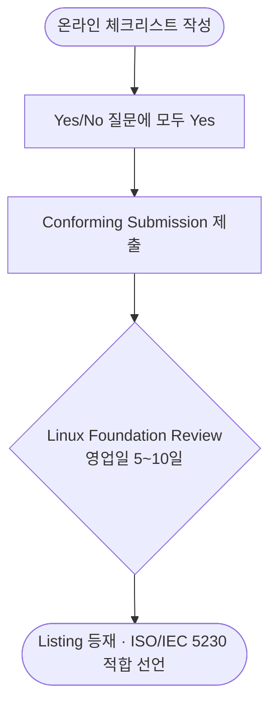

<!--
  Part 0 도입 + Part 1 ISO 표준 이해 (슬라이드 1~19)
  근거: opensource_for_enterprise/0-openchain·_index, iso5230_guide·iso18974_guide·iso42001_guide _index, iso42001_guide/compare
  컴포넌트: Callout · EvidenceCard · StandardCompare · HexCoreElements
-->

# 기업 오픈소스 거버넌스 구축 실무

ISO 표준부터 AI 컴플라이언스까지

  ISO/IEC 5230 · 18974 · 42001 · AI 컴플라이언스 — 4시간 실무 교육

  OpenChain Korea Work Group · CC BY 4.0

---

# '아는 것'에서 '지키는 체계'로

### 우리가 이미 아는 것

- 오픈소스를 쓰면 라이선스 의무가 따른다
- 취약점은 패치해야 한다
- SBOM이라는 게 있다더라

### 이 강의가 더하는 것

- 그 활동을 **반복 가능한 체계**로 만든다
- 활동을 **입증자료**로 남겨 인증으로 연결한다
- 공급망·AI까지 **거버넌스로 확장**한다

<Callout variant="info" title="이 강의의 기준">
오픈소스 관리는 개인 역량이 아니라 <strong>조직의 관리 체계</strong>다. 적은 리소스로 적정 수준의 리스크를 관리하는 것이 목표다.
</Callout>

---

# 왜 거버넌스 체계가 필요한가

### 소송·공급망 리스크는 실재한다

<v-click>

- **2009 BusyBox(GPL-2.0) 소송** — 국내 2곳 포함 14개 사가 대상. 제품을 직접 개발하지 않고 **배포만 한 회사도 피소**

</v-click>

<v-click>

- 복잡한 공급망에서는 한 기업이 아무리 완벽해도 단독으로 컴플라이언스를 달성하기 어렵다

</v-click>

<v-click>

- 결국 **공급망 전체의 신뢰**가 필요하다 — OpenChain이 출발한 지점

</v-click>

<Callout variant="critical" title="핵심 메시지">
오픈소스 컴플라이언스는 기업 이익을 차별화하는 분야가 아니다. 모두가 자산을 공유할수록, 적은 리소스로 함께 달성한다.
</Callout>

출처: OpenChain Open Source Software License Compliance General Public Guide

---

# 오늘 얻어갈 것

### 1. 표준 이해

ISO/IEC 5230 · 18974 · 42001 세 표준의 목적과 입증자료 셈법을 명확히 한다

### 2. 체계 구축

조직·정책·프로세스·도구·교육·준수 — **6대 핵심 요소**를 단계별로 세운다

### 3. 첫 액션

AI 컴플라이언스까지 확장하고, 라이브 데모로 **오늘 바로 시작**한다

---

# 강의 구성 로드맵

총 4시간(240분) · 6개 파트

| 파트 | 주제 | 시간 | 핵심 |
|------|------|:----:|------|
| **Part 0** | 도입 | 10분 | 왜 거버넌스인가 |
| **Part 1** | ISO 표준 이해 | 30분 | 5230 · 18974 · 42001 |
| **Part 2** | 6대 핵심 요소 구축 | **90분** | 조직·정책·프로세스·도구·교육·준수 |
| **Part 3** | AI 컴플라이언스 | **75분** | 모델·데이터셋·AI SBOM·공급망 |
| **Part 4** | 라이브 데모 | 20분 | Trusted OSS 실연 |
| **Part 5** | 마무리 + Q&A | 15분 | 핵심 3가지·첫 액션 |

<Callout variant="info" title="시간 배분 의도">
2026년 들어 AI 영역이 가장 빠르게 변하므로 <strong>Part 3을 75분으로 확장</strong>했다. 변경이 적은 Part 1·2는 진행 속도로 압축한다.
</Callout>

---
layout: section
---

# Part 1 — ISO 표준 이해

5230 · 18974 · 42001, 그리고 입증자료 셈법 — 30분

---

# OpenChain Project란?

- **Linux Foundation**이 운영하는 프로젝트
- 2016년 시작 — 퀄컴·지멘스·윈드리버·ARM·어도비 등 글로벌 기업 참여
- 오픈소스 컴플라이언스의 **핵심 요구사항을 간결·일관되게** 정의

### 세 가지 제공물

1. **OpenChain 규격** (10페이지)
2. **적합성 인증** (자가 인증 무료)
3. **문서 자료** (정책·교육 템플릿, CC-0)

<Callout variant="success" title="공급망 철학">
한 기업의 컴플라이언스 수준을 높이려면 공급망 내 모든 구성원의 수준을 높여야 한다. 선진 기업이 자산을 공개해 누구나 참고하도록 한다.
</Callout>

---

# ISO/IEC 5230 — 라이선스 컴플라이언스 국제표준

- OpenChain 규격 **v2.1**이 2020년 12월 **ISO/IEC 5230:2020**으로 정식 등록
- **오픈소스 컴플라이언스를 정의한 최초의 국제 표준**
- 기업 규모·업종 무관하게 적용 가능
- 공급망에서 공급자에게 5230 준수를 요구하는 사례 증가 (Scania STD 4589, Bosch 등)

<Callout variant="success" title="ISO/IEC 5230:2020 (OpenChain Specification v2.1)">
오픈소스 컴플라이언스 달성을 위해 기업이 갖춰야 할 <strong>6대 핵심 요구사항</strong>과 이를 입증하는 <strong>입증자료 목록(25개)</strong>을 정의한다.
</Callout>

---

# ISO/IEC 5230 — 6대 핵심 요구사항

<HexCoreElements />

①프로그램 기반(§3.1) · ②관련 업무(§3.2) · ③콘텐츠 검토·승인(§3.3) · ④컴플라이언스 산출물(§3.4) · ⑤커뮤니티 참여(§3.5) · ⑥규격 준수(§3.6)

<Callout variant="info" title="구축 전략">
처음 시작하는 기업은 이 6대 요구사항을 하나씩 충족해 가며 수준을 향상시키는 것이 효과적이다. Part 2에서 6대 요소를 단계별로 세운다.
</Callout>

---

# ISO/IEC 5230 입증자료 25개 — 한눈에

13개 조항 / 25개 입증자료 항목 — EVIDENCE-CHECK 기준 전 항목 ✅ 충족

<EvidenceCard number="3.1.1.1" title="문서화된 오픈소스 정책" standard="5230" clause="§3.1.1" status="full" />
<EvidenceCard number="3.1.4.1" title="프로그램 적용 범위 문서" standard="5230" clause="§3.1.4" status="full" />
<EvidenceCard number="3.2.2.1" title="역할 담당자 이름 문서" standard="5230" clause="§3.2.2" status="full" />
<EvidenceCard number="3.3.1.1" title="SBOM 관리 절차" standard="5230" clause="§3.3.1" status="full" />
<EvidenceCard number="3.3.2.1" title="라이선스 사용 사례 처리 절차" standard="5230" clause="§3.3.2" status="full" />
<EvidenceCard number="3.6.1.1" title="모든 요구사항 충족 확인 문서" standard="5230" clause="§3.6.1" status="full" />

<Callout variant="info" title="조항 분포">
§3.1 프로그램 기반(8) · §3.2 관련 업무(7) · §3.3 콘텐츠 검토(3) · §3.4 산출물(2) · §3.5 커뮤니티(3) · §3.6 준수(2) = <strong>25개</strong>. 항목별 상세는 Part 2에서 전개한다.
</Callout>

---

# ISO/IEC 18974 — 보안 보증(5230과 쌍)

- 2023년 발표 — **OpenChain Security Assurance** 규격 기반
- 오픈소스의 **알려진 보안 취약점**을 관리하는 핵심 요구사항 정의
- 5230 위에 **취약점 탐지·평가·대응 보안 레이어**를 추가
- 정책·역량·SBOM 등 핵심 인프라를 5230과 **공유**

<Callout variant="warn" title="ISO/IEC 18974:2023 (OpenChain Security Assurance)">
보안 프로세스 핵심 영역 식별 · 역할과 책임 할당 · 프로세스의 지속 가능성 보장. 5230이 라이선스라면, 18974는 <strong>보안 취약점 관리</strong>에 초점을 맞춘 상호 보완 표준이다.
</Callout>

---

# 18974 입증자료 셈법 — 공통 16 파생 · 전용 9 강화

### 18974 = 25개 (5230과 동수)

- **16개**: 5230 대응 항목을 **기반으로 파생** 단순 복사가 아니라 보안 관점의 추가 작성 필요
- **9개(★)**: 18974 **전용 보안 특화** 항목

### ★ 전용 9개

4.1.2.3 · 4.1.2.5 · 4.1.2.6 · 4.1.4.2 · 4.1.4.3 · 4.1.5.1 · 4.2.2.3 · 4.3.2.1 · 4.3.2.2

<EvidenceCard number="4.1.5.1" title="8가지 취약점 처리 방법 문서화" standard="18974" clause="§4.1.5 ★" status="full" />

<EvidenceCard number="4.3.2.1" title="취약점 탐지 및 해결 절차" standard="18974" clause="§4.3.2 ★" status="full" />

<Callout variant="warn" title="강도 차이 주의">
★ 9개 전용 항목은 다른 항목보다 강한 <strong>Documented Evidence(문서화된 증거)</strong>를 요구한다 — 단순 <code>document</code>보다 한 단계 강한 증거 수준이다.
</Callout>

---

# ISO/IEC 42001 — AI 관리 시스템

- 2023년 발행 — AI를 책임감 있게 개발·운영하는 **AI 관리 시스템(AIMS)** 표준
- 제정: **ISO/IEC JTC 1/SC 42** (5230·18974와 달리 OpenChain과 무관)
- ISO 9001·27001과 **동일한 경영 시스템 구조** (PDCA)
- 입증자료 번호 체계 없음 — **shall 요구사항** 방식

<Callout variant="info" title="오픈소스 관점의 42001">
이 강의는 42001 전체가 아니라 <strong>오픈소스와 교차하는 6개 조항</strong>(§5.2·6.1.2·7.5·8.5·8.6·8.8)에 집중한다 — AI 프레임워크·모델·데이터셋·AI SBOM·공급망 검증.
</Callout>

---

# 세 표준 비교 — 한눈에

<StandardCompare highlight="42001" :rows="[
  { aspect: '대상', v5230: '라이선스 컴플라이언스', v18974: '보안 취약점 관리', v42001: 'AI 관리 시스템' },
  { aspect: '제정', v5230: 'OpenChain → ISO', v18974: 'OpenChain → ISO', v42001: 'ISO JTC1/SC 42' },
  { aspect: '발행', v5230: '2020', v18974: '2023', v42001: '2023' },
  { aspect: '요구 방식', v5230: '입증자료 번호', v18974: '입증자료 번호', v42001: 'shall 요구사항' },
  { aspect: '입증자료', v5230: '25개', v18974: '25개', v42001: '체크포인트(번호 없음)' },
  { aspect: '자가 인증', v5230: 'OpenChain 체크리스트(무료)', v18974: 'OpenChain 체크리스트(무료)', v42001: '없음 — 갭분석/인증기관' },
]" />

<Callout variant="info" title="교차점">
5230·18974는 <strong>오픈소스 자체</strong>를, 42001은 <strong>AI 시스템</strong>을 관리한다. AI 시스템이 오픈소스를 활용할 때 교차점이 발생한다.
</Callout>

---

# ISO/IEC 42001 준수 확인 3종 + 동향

### 1. 자체 갭 분석

내부적으로 각 shall 조항을 검토해 현재 수준 평가·개선 계획 수립. 무료 · 이 가이드의 체크포인트 활용

### 2. 제2자 심사

고객사·파트너사가 직접 AI 관리 시스템 평가. 공급망 신뢰 구축 목적

### 3. 제3자 인증

BSI·TÜV SÜD 등 ISO 인증기관이 공식 인증서 발급. ISO 27001과 동일 방식

<Callout variant="info" title="ISO/IEC 42006 동향">
42001 <strong>인증기관 요건</strong>을 정의하는 ISO/IEC 42006이 개발 중이다. 제3자 인증 생태계가 정비되면 42001 인증의 일관성·신뢰도가 높아진다.
</Callout>

---

# 자가 인증이란? — 3단계

OpenChain 자가 인증(ISO/IEC 5230) — 가장 권장되고 비용이 없는 방법

둥근 사각형 = 시작/종료 · 마름모 = 검토 분기 · 전 과정 보통 1~2주

<Callout variant="success" title="권장 경로">
OpenChain 적합성을 선언한 대부분의 기업도 자가 인증을 채택했다. 자가 인증 과정에서 <strong>부족한 부분</strong>을 스스로 파악할 수 있다.
</Callout>

---

# 자가 인증 결과 예시 — 3단 판정

자가 점검 시 각 입증자료를 ✓ / △ / ✗ 로 판정한다

| 입증자료 | 충족 상태 | 판정 | 보완 액션 |
|---------|----------|:----:|----------|
| 3.1.1.1 문서화된 오픈소스 정책 | 정책 문서 존재·승인 완료 | **✓ 충족** | — |
| 3.1.2.3 역량 평가 증거 | 역할 정의는 있으나 평가 기록 없음 | **△ 부분** | 역량 평가 기록부 작성 |
| 3.6.2.1 18개월 충족 확인 문서 | 회고형 확인 문서 미작성 | **✗ 누락** | 재확인 기록 절차 수립 |

<Callout variant="warn" title="심사 관점">
자가 인증 체크리스트는 모든 질문에 <strong>Yes</strong>일 때만 제출(Submission)할 수 있다. △·✗ 항목을 먼저 ✓로 끌어올려야 한다.
</Callout>

---

# 인증 후 얻는 것

### 공급망 신뢰

- Global Software Supply Chain에서 **5230 준수 기업**으로 인정
- 공급망 구매자(예: Scania STD 4589·Bosch)의 준수 요구에 대응
- OEM·규제 입찰에서 **차별화 요소**

### 리스크 대응

- 라이선스 위반·소송 리스크 **체계적 관리**
- 18974 추가 시 **보안 취약점 대응** 보증
- 국내 사례: KT가 2024년 10월 **ISO/IEC 18974 인증** 획득

<Callout variant="info" title="단계적 확장">
자가 인증만으로도 많은 공급망 파트너의 요구 수준을 충족한다. 이후 <strong>독립 평가 → 제3자 인증</strong>으로 신뢰도를 높일 수 있다.
</Callout>

---

# 파트 1 요약

### 세 표준

- **ISO/IEC 5230** — 라이선스 컴플라이언스 (2020)
- **ISO/IEC 18974** — 보안 보증 (2023)
- **ISO/IEC 42001** — AI 관리 시스템 (2023)

### 인증

- 5230·18974: OpenChain 자가 인증(무료) → 독립 평가 → 제3자 인증
- 42001: 자체 갭분석 / 제2자 / 제3자 (체크리스트 없음)

<Callout variant="success" title="입증자료 셈법 — 전 덱 통일">
5230 <strong>25개</strong> · 18974 <strong>25개</strong> = 합계 <strong>50개</strong>. 18974의 16개는 5230 항목에서 <strong>파생</strong>, 9개(★)는 보안 <strong>전용</strong>이다. 42001은 입증자료 번호 체계가 없어 이 셈법에 포함되지 않는다.
</Callout>

50

5230 25 + 18974 25 (공통 16 파생 · 전용 9)

