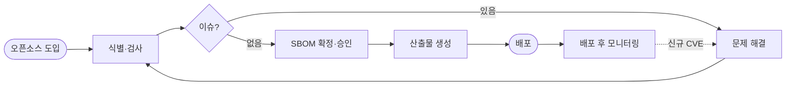
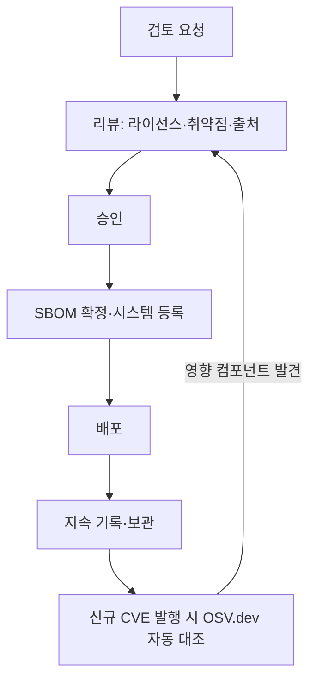
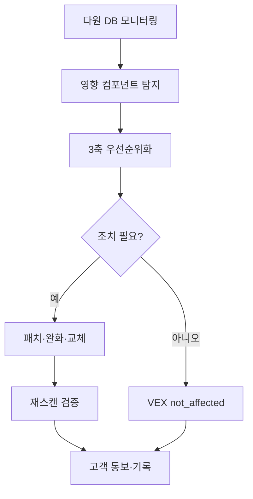

# 2-1 조직 — 역할·책임·역량 정의

<HexCoreElements :active="1" />

누가, 무엇에 책임을 지는가 — 체계의 출발점은 사람을 정하는 일이다.

<!--
강사 노트: 여기서부터 6대 요소의 첫 번째인 '조직'에 들어갑니다. 앞 파트에서 본 거버넌스 체계는 결국 누가 무엇에 책임지는지를 정하는 데서 출발한다는 점을 강조하세요. "정책도 프로세스도 결국 사람이 굴리는 것"이라는 한 줄로 다음 슬라이드들의 흐름(조직 → 역할 → 역량 → 명단)을 예고하면 자연스럽습니다.
-->

---

# 오픈소스 관리 조직(OSPO)

<div class="grid grid-cols-2 gap-8">
<div>

**오픈소스 프로그램 오피스(OSPO)**
오픈소스 관리를 위한 전담 조직 — '오픈소스 사무국'이라고도 한다.

**오픈소스 프로그램 매니저(OSPM)**
- 회사 오픈소스 프로그램의 총괄 책임자
- 가능한 한 풀타임 보장 권장
- 오픈소스 생태계 이해 · 비즈니스 이해 · 전파 역량

</div>
<div>

**전담 vs 겸직**
- 반드시 풀타임일 필요는 없다
- OSRB(Open Source Review Board) 형태의 **가상 조직**으로도 운영 가능
- 법무·IT·보안·개발문화·사업부서가 협업

</div>
</div>

<Callout variant="info">
글로벌 ICT 기업의 OSPM 채용 공고: TODO Group job-descriptions에서 직무 정의를 참고할 수 있다.
</Callout>

<!--
강사 노트: OSPO는 거창한 별도 조직이 아니어도 된다는 점을 먼저 안심시키세요. 핵심은 OSPM 한 명에게 총괄 책임을 명확히 부여하는 것이고, 풀타임이 어렵다면 OSRB 같은 가상 조직 형태로도 ISO 요건을 충족할 수 있습니다. 청중 대부분이 "우리는 전담 조직이 없는데요"라고 걱정하므로, 겸직·가상 조직도 인정된다는 메시지를 분명히 전달하는 것이 이 슬라이드의 목적입니다.
-->

---

# 규모별 조직 구성

<div class="grid grid-cols-3 gap-4">
<div>

**소규모**
OSPM 1인이 모든 역할 수행 가능 (필요 시 외부 자문 보완)

</div>
<div>

**중규모**
OSPM + IT 담당 + 법무 자문 계약

</div>
<div>

**대규모**
OSPM · 법무 · IT · 보안(PSIRT) · 개발문화 · 사업부서 챔피언 + 모범 사례 검증 담당

</div>
</div>

<v-click>

<Callout variant="warn" title="1인 다역 운영 시 인증 심사 주의 (권한 분리)">

1명이 여러 역할을 수행하는 것은 ISO 표준이 허용하지만, 심사관은 추가로 확인한다.

- **시간 배분**: 각 역할의 업무 시간 비율(주간)을 §3.2.2.2 인원 배치 입증자료에 명시
- **전문성 입증**: 역할별 역량(특히 §4.2.2.3 보안 취약점 해결 전문성) 동일 인물 보유 증명
- **권한 분리**: 의사결정·승인·집행 권한이 한 사람에게 집중되지 않도록 부분 위임(외부 OSRB 자문위원 등)

</Callout>

</v-click>

<!--
강사 노트: 소·중·대 규모별 구성을 보여주면서 "우리 회사는 어디에 해당할까"를 청중이 스스로 떠올리게 하세요. 1인 다역은 ISO가 허용하지만 인증 심사에서는 권한 집중을 추가로 확인한다는 점이 실무 핵심입니다. v-click으로 주의 박스를 펼치면서, 시간 배분을 §3.2.2.2 인원 배치 입증자료에 명시하고 승인 권한 일부를 외부 자문위원에게 위임해 권한 분리를 입증하라는 팁을 강조하세요. 이 부분은 심사에서 자주 지적되는 함정입니다.
-->

---

# 담당자 역할·책임 문서화

ISO 5230 §3.1.2.1 · ISO 18974 §4.1.2.1 — 참여자별 역할과 책임을 나열한 문서를 요구한다.

| 역할 | 핵심 책임 | ISO 매핑 |
|---|---|---|
| 오픈소스 프로그램 매니저 | 오픈소스 프로그램 총괄 | §3.1.2.1 · §4.1.2.1 |
| 법무 담당 | 라이선스·의무 해석, 법적 위험 자문 (외부 변호사 대체 가능) | §3.2.2.3 |
| IT 담당 | 분석 도구 운영·자동화, 전 배포 SW 분석 시스템 구축 | §3.1.2.1 |
| 보안 담당 (PSIRT) | 취약점 분석 + **해결 전문성**(CVE 분석·CVD 처리) | §4.2.2.3 |
| 개발 문화 담당 | 오픈소스 활용·커뮤니티 참여 문화 전파 | §3.1.3.1 |
| 사업 부서 (팀별 1인 챔피언) | 정책·프로세스 준수 | §3.2.2.1 |
| 내부 모범 사례 검증 담당 ★ | NIST SSDF·OWASP 등과 일치 정기 검증 | §4.1.2.6 |

<!--
강사 노트: 이 표는 "어떤 역할을 누가 맡는지를 문서로 남겨라"는 §3.1.2.1·§4.1.2.1 요건을 한눈에 보여줍니다. 행 하나하나가 입증자료 조항으로 연결된다는 점을 짚어 주세요. 특히 보안 담당(PSIRT)은 단순 취약점 탐지가 아니라 CVE 분석·CVD 처리 같은 '해결 전문성'(§4.2.2.3)까지 요구된다는 점, 그리고 ★ 표시된 내부 모범 사례 검증 담당은 ISO 18974 전용 항목임을 강조하면 좋습니다. 외부 변호사로 법무 역할을 대체할 수 있다는 점도 중소기업 청중에게 안심 포인트입니다.
-->

---

# 역할별 역량 정의·평가

<div class="grid grid-cols-2 gap-8">
<div>

ISO 5230 §3.1.2.2 · ISO 18974 §4.1.2.2 — 각 역할에 필요한 **역량을 기술한 문서**를 요구한다.

역량 문서가 있어야:
- 담당자가 역할 수행 역량을 갖췄는지 평가하고
- 부족 시 교육을 제공할 수 있다.

**예: 보안 담당 필요 역량**
DevSecOps 이해 · 취약점 분석 도구 이해 · 보안 취약점 전문 지식 · 위험 평가 능력

</div>
<div>

<EvidenceCard number="3.1.2.2" title="역할별 필요 역량 문서" standard="5230" clause="§3.1.2" status="full" />

<EvidenceCard number="4.1.2.2" title="역할별 역량 문서 (보안 포함)" standard="18974" clause="§4.1.2" status="full" />

</div>
</div>

<!--
강사 노트: 역할을 정했으면 그 역할에 '어떤 역량이 필요한가'를 따로 문서화해야 한다는 게 §3.1.2.2·§4.1.2.2의 핵심입니다. 역량 문서가 있어야 담당자가 자격을 갖췄는지 평가하고, 부족하면 교육으로 메울 수 있다는 인과 관계를 설명하세요. 오른쪽 보안 담당 역량 예시(DevSecOps·취약점 분석 도구·위험 평가)는 뒤에 나오는 보안 프로세스 슬라이드와 연결되니, "역량 정의가 곧 교육 커리큘럼의 근거가 된다"고 미리 다리를 놓아 두면 흐름이 매끄럽습니다.
-->

---

# 참여자 목록 문서화 (★ 18974)

<div class="grid grid-cols-2 gap-8">
<div>

§3.2.2.1 · §4.1.2.3 — 각 역할을 담당하는 **인원·그룹·직무의 이름**을 기재한 문서를 요구한다.

- 익명 표기(OOO) 대신 **가상 실명** 또는 **별도 부록 명단 + 직무명**
- 사업 부서는 **"전원" 표기 금지** → **팀별 1인 챔피언** 모델로 책임 소재 명확화
- 외부 계약 시 계약서 ID 병기

</div>
<div>

<EvidenceCard number="4.1.2.3" title="참여자 명단과 역할 ★" standard="18974" clause="§4.1.2" status="full" />

<v-click>

<Callout variant="warn" title="Documented Evidence 강도">
4.1.2.3은 18974 전용(★) 항목으로 단순 명단을 넘어 회의록·역할 지정 이력 등 <b>실제 수행 증거(증거 팩)</b>를 함께 요구한다. "전원" 표기는 §3.2.2.1 "이름" 요건 미충족.
</Callout>

</v-click>

</div>
</div>

<!--
강사 노트: 실무에서 가장 자주 막히는 지점입니다. 개인정보 때문에 익명(OOO)으로 쓰고 싶어 하지만, ISO는 '이름'을 요구하므로 가상 실명이나 별도 부록 명단으로 직무명과 함께 특정해야 합니다. 사업 부서를 "전원"으로 뭉뚱그리면 책임 소재가 불명확해 요건 미충족이 되니, 팀별 1인 챔피언 모델로 좁히라고 강조하세요. v-click 박스에서는 18974 ★ 항목은 명단만이 아니라 회의록·역할 지정 이력 같은 '수행 증거(증거 팩)'까지 요구한다는 점이 심사 포인트입니다.
-->

---

# 2-2 정책 — 성문화된 판단 기준

<HexCoreElements :active="2" />

조직이 정해졌다면, 그 조직이 따를 **판단 기준**을 글로 남긴다.

<!--
강사 노트: 두 번째 요소 '정책'으로 넘어갑니다. 앞에서 사람을 정했으니, 이제 그 사람들이 똑같은 기준으로 판단하도록 글로 남기는 단계라고 전환 멘트를 던지세요. 정책은 '성문화된 판단 기준'이라는 한 줄 정의가 이 섹션 전체를 관통합니다. 정책이 없으면 담당자마다 다른 기준으로 판단해 일관성이 무너진다는 점을 짧게 짚으면 이어지는 슬라이드들의 동기가 분명해집니다.
-->

---

# 정책 — 판단 기준의 통일

<div class="grid grid-cols-2 gap-8">
<div>

오픈소스 정책은 공급 소프트웨어 개발·서비스·배포에 관여하는 조직이 **올바르게 오픈소스를 활용하기 위한 원칙**이다.

- 문서화하고
- 조직 내 전파하고
- 정기적으로 검토·갱신한다.

</div>
<div>

ISO 5230 §3.1.1.1 — 문서화된 오픈소스 정책
ISO 18974 §4.1.1.1 — 문서화된 보안 보증 정책

<Callout variant="info">
정책은 문서화에 그치지 않고 실제 이행되어야 한다. 정기 검토·갱신과 참여자 교육이 함께 필요하다.
</Callout>

</div>
</div>

<!--
강사 노트: 정책의 세 가지 동사 — 문서화하고, 전파하고, 정기적으로 검토·갱신한다 — 를 손가락으로 꼽으며 강조하세요. ISO 5230은 라이선스 컴플라이언스 정책(§3.1.1.1), ISO 18974는 보안 보증 정책(§4.1.1.1)을 각각 요구한다는 대응 관계를 짚어 주면 좋습니다. 가장 흔한 오해가 "문서만 만들면 끝"인데, 정책은 책상 서랍에 넣어 두는 게 아니라 실제 이행과 교육이 따라와야 인증이 된다는 점을 못 박으세요.
-->

---

# 정책 핵심 항목

<div class="grid grid-cols-3 gap-4">

<EvidenceCard number="3.1.1.1" title="라이선스 컴플라이언스 원칙" standard="5230" clause="§3.1.1" status="full" />

<EvidenceCard number="4.1.1.1" title="보안 보증 원칙" standard="18974" clause="§4.1.1" status="full" />

<EvidenceCard number="3.5.1.1" title="오픈소스 기여 정책" standard="5230" clause="§3.5.1" status="full" />

</div>

<div class="mt-4">

오픈소스 정책이 포함해야 할 5대 원칙:

1. 라이선스 컴플라이언스 및 보안 취약점 리스크 최소화
2. 외부 오픈소스 프로젝트 **기여** 원칙
3. 자사 소프트웨어 **공개** 원칙
4. **SBOM**(Software Bill of Materials) 생성·관리 원칙
5. 알려진 취약점·새로 발견된 취약점 **대응** 원칙

</div>

<!--
강사 노트: 위쪽 EvidenceCard 3개는 정책이 충족해야 할 입증자료(라이선스 컴플라이언스·보안 보증·기여 정책)를, 아래 5대 원칙은 정책 본문에 실제로 담아야 할 내용을 보여줍니다. 청중이 자사 정책을 점검할 체크리스트로 5대 원칙을 받아 적게 하세요. 컴플라이언스만이 아니라 기여·공개·SBOM·취약점 대응까지 포함해야 한다는 점이 핵심이며, 특히 SBOM과 취약점 대응은 뒤 슬라이드에서 깊게 다룬다고 예고하면 흐름이 이어집니다.
-->

---

# 라이선스 컴플라이언스 정책 상세

<div class="grid grid-cols-2 gap-8">
<div>

정책의 라이선스 컴플라이언스 절에는 다음을 명시한다:

- 오픈소스 식별 및 라이선스 의무 검토 (SCA 도구 활용)
- 라이선스를 고려한 아키텍처 설계
- 컴플라이언스 산출물 생성·관리
- **SBOM 생성·관리**
- 컴플라이언스 이슈 대응 절차

</div>
<div>

<Callout variant="success" title="SBOM 형식 현행화">

SBOM 표준 형식은 최신 버전으로 유지한다.

- **SPDX 2.3+** (ISO/IEC 5962)
- **CycloneDX 1.6+**
- NTIA 최소 요소(7요소) 충족
- 취약점 정보는 **VEX**와 cross-link

</Callout>

</div>
</div>

<!--
강사 노트: 라이선스 컴플라이언스 절에 무엇을 명시해야 하는지 왼쪽 목록으로 짚어 주세요 — 식별·검토부터 SBOM 생성·관리, 이슈 대응 절차까지입니다. 오른쪽 박스는 최신성 강조 포인트입니다. SBOM 형식을 SPDX 2.3+ / CycloneDX 1.6+ 같은 최신 버전으로 유지하고 NTIA 7요소를 충족하라는 것, 그리고 취약점 정보는 SBOM에 직접 넣지 말고 VEX와 cross-link하라는 점이 실무 팁입니다. 구버전 SPDX를 그대로 쓰는 회사가 많아 심사에서 현행화 여부를 확인받기 쉽습니다.
-->

---

# 보안 보증 정책 — 취약점 우선순위 3축

<div class="grid grid-cols-2 gap-6">
<div>

정책은 CVSS 단일 점수가 아닌 **3축**으로 우선순위를 정한다.

- **CVSS** — 심각도 (v3.1 / v4.0 병기, 더 높은 점수 기준)
- **EPSS** — 향후 30일 내 익스플로잇 **확률**(FIRST.org)
- **CISA KEV** — **실제 악용 중**인 취약점 카탈로그 등재 여부

<Callout variant="success" title="조치 권고 일정 (예시)">
Critical 7일 이내 · High 30일 이내 · Medium 90일 이내 · Low 다음 릴리스
</Callout>

</div>
<div>

<CvssScoring :cvss="9.8" version="4.0" :epss="0.74" kev vector="CVSS:4.0/AV:N/AC:L/AT:N/PR:N/UI:N" />

<div class="mt-4 text-sm opacity-80">

KEV 등재 + 높은 EPSS → CVSS가 같아도 **즉시 조치** 대상. 단순 점수가 아닌 "실제 악용 가능성"을 반영한다.

</div>

</div>
</div>

<!--
강사 노트: 이 슬라이드의 메시지는 "CVSS 점수 하나로 우선순위를 정하지 말라"입니다. 3축을 분리해 설명하세요 — CVSS는 심각도, EPSS는 향후 30일 내 악용될 확률(FIRST.org), CISA KEV는 이미 실제 악용이 확인된 카탈로그입니다. 실무 팁: 똑같이 CVSS 9.8이라도 KEV에 등재됐거나 EPSS가 높으면 먼저 조치해야 합니다. 심사 포인트로는 조치 권고 일정(Critical 7일·High 30일 등)을 정책에 수치로 박아 두면 평가자가 좋아한다는 점, 그리고 EPSS·KEV는 시간에 따라 바뀌므로 재평가 주기를 정해 두라는 점을 덧붙이세요. CVSS는 v3.1과 v4.0을 병기하고 더 높은 점수를 기준으로 삼습니다.
-->

---

# 취약점 통보 — VEX 4상태값

<div class="grid grid-cols-2 gap-8">
<div>

공급망 파트너·고객에게 영향 여부를 통보할 때는 **VEX**(Vulnerability Exploitability eXchange) 표준을 사용한다.

표준 형식:
- **CSAF 2.0** (OASIS)
- **CycloneDX VEX**

`not_affected`는 고객의 **불필요한 패치 작업을 차단**하는 핵심 신호 — justification 필수.

</div>
<div>

<VexStatus legend />

<div class="mt-4">

<VexStatus status="not_affected" justification="vulnerable_code_not_in_execute_path" />

</div>

<div class="mt-3 text-sm opacity-80">

| 상태값 | 의미 |
|---|---|
| `not_affected` | CVE 존재하나 사용 맥락상 영향 없음 |
| `affected` | 영향 있음 (조치 진행 중) |
| `fixed` | 패치 적용 완료 |
| `under_investigation` | 영향 조사 중 |

</div>

</div>
</div>

<!--
강사 노트: VEX는 "이 CVE가 우리 제품에 영향을 주는가"를 공급망 파트너와 고객에게 표준 형식으로 알리는 도구라고 한 줄로 정의하세요. 표준 형식은 CSAF 2.0(OASIS)과 CycloneDX VEX 두 가지입니다. 가장 강조할 상태값은 not_affected입니다 — CVE가 존재하더라도 우리가 쓰는 맥락에서는 영향이 없다는 신호로, 고객의 불필요한 패치 작업을 막아 줍니다. 단, justification(예: 취약 코드가 실행 경로에 없음)이 반드시 따라붙어야 인정됩니다. 실무 팁: justification 없는 not_affected는 심사에서 '근거 없는 면제'로 반려될 수 있습니다.
-->

---

# 내부 책임 할당·미준수 시정 절차

§3.2.2.4 · §4.2.2.4 (책임 할당) · §3.2.2.5 (미준수 검토·시정) — 문서화된 절차를 요구한다.

| 단계 | 책임 할당 (§3.2.2.4) | 미준수 시정 (§3.2.2.5) |
|---|---|---|
| 1 | OSPM이 연간 책임 할당 회의 소집 | 미준수 사례 접수·확인 (OSPM) |
| 2 | 부서장과 협의해 활동별 책임자 선정 | 법무팀 협력 심각성 평가 |
| 3 | OSRB에 제출·최종 승인 | 필요 조치 결정·수행 |
| 4 | 결과 공식 문서화 (문서 관리 시스템 등록) | Jira 등 추적 시스템에 기록·보존 |
| 5 | 신규 책임자 교육·전사 인식 제고 | 정기 검토로 재발 방지 반영 |

<!--
강사 노트: 정책이 있어도 안 지키면 어떻게 하느냐 — 그 답이 이 두 절차입니다. 왼쪽은 책임을 누구에게 할당할지(§3.2.2.4·§4.2.2.4), 오른쪽은 미준수가 발생했을 때 검토·시정하는 절차(§3.2.2.5)입니다. 표를 단계별로 따라가며 "OSPM이 접수하고, 법무와 심각성을 평가하고, 조치를 결정해 추적 시스템에 기록한다"는 흐름을 보여 주세요. 실무 팁: 미준수 사례를 Jira 같은 추적 시스템에 남기고 정기 검토로 재발 방지에 반영하는 마지막 단계가 빠지면 '일회성 대응'으로 보여 감점되기 쉽습니다.
-->

---

# 적용 범위·예산·자문·외부 문의

<div class="grid grid-cols-2 gap-4">

<EvidenceCard number="3.1.4.1" title="프로그램 적용 범위·한계 진술" standard="5230" clause="§3.1.4" status="full">
배포 안 하는 조직은 범위 제외 가능 · 비즈니스 변화 시 갱신
</EvidenceCard>

<EvidenceCard number="3.2.2.2" title="인원 배치·예산 적정성" standard="5230" clause="§3.2.2" status="full">
교육·도구·외부 컨설팅 예산 항목 명시
</EvidenceCard>

<EvidenceCard number="3.2.2.3" title="법률 전문 자문 접근 방법" standard="5230" clause="§3.2.2" status="full">
사내 법무 우선, 첨예 시 외부 로펌 (OpenChain 파트너 법무법인)
</EvidenceCard>

<EvidenceCard number="3.2.1.1" title="외부 문의 공개 채널" standard="5230" clause="§3.2.1" status="full">
oss@ / security@ 분리 · security.txt (RFC 9116)
</EvidenceCard>

</div>

<!--
강사 노트: 자주 잊히는 '주변 입증자료' 네 가지를 한 슬라이드로 모았습니다. 빠르게 훑되 각 카드의 실무 포인트를 한 줄씩 짚으세요 — 배포하지 않는 조직은 적용 범위에서 제외할 수 있다(§3.1.4.1), 예산에는 교육·도구·외부 컨설팅 항목을 명시한다(§3.2.2.2), 법률 자문은 사내 법무 우선·첨예 시 외부 로펌(§3.2.2.3), 외부 문의는 oss@와 security@를 분리하고 RFC 9116 security.txt를 두라(§3.2.1.1). 특히 security.txt는 보안 연구자가 취약점을 신고할 공식 창구라 실무에서 놓치기 쉬운데 비용 없이 충족할 수 있다고 권하세요.
-->

---

# 성과 메트릭·기여 정책 (★ 18974) + 정책 템플릿

<div class="grid grid-cols-2 gap-8">
<div>

ISO 18974 전용(★) 추가 요구:
- **§4.1.4.2** 프로그램이 달성할 **성과 메트릭 세트**
- **§4.1.4.3** 검토·갱신·감사로 **지속적 개선** 입증

기여 정책(§3.5.1.1)은 CLA 검토·저작권 표기·회사 이메일 사용 등을 다룬다.

</div>
<div>

<Callout variant="info" title="정책 템플릿 제공 (CC BY 4.0)">
OpenChain KWG는 ISO 5230·18974 요구사항을 충족하는 <b>오픈소스 정책 템플릿</b>을 제공한다. CC BY 4.0으로 자유롭게 활용·수정 가능하다.
</Callout>

</div>
</div>

<!--
강사 노트: 정책 섹션의 마무리입니다. ISO 18974 전용(★) 요구로 성과 메트릭 세트(§4.1.4.2)와 검토·갱신·감사를 통한 지속적 개선 입증(§4.1.4.3)이 추가된다는 점을 짚으세요 — 보안 보증은 한 번 만들고 끝이 아니라 측정과 개선이 따라야 합니다. 마지막으로 KWG가 ISO 요건을 충족하는 정책 템플릿을 CC BY 4.0으로 제공한다고 안내하세요. 청중에게 "맨땅에서 쓰지 말고 템플릿에서 출발하라"는 실무 조언으로 정책 섹션을 닫으면 좋습니다.
-->

---

# 2-3 프로세스 — 정책이 작동하는 절차

<HexCoreElements :active="3" />

정책은 선언, 프로세스는 실행 — 정책을 일상 업무에서 작동하게 만드는 절차다.

<!--
강사 노트: 세 번째 요소 '프로세스'로 전환합니다. "정책은 선언, 프로세스는 실행"이라는 대비를 분명히 던지세요. 아무리 좋은 정책도 일상 업무에서 작동하는 절차로 풀어내지 않으면 죽은 문서라는 점이 이 섹션의 출발점입니다. 이어지는 슬라이드들이 도입 → 식별·검사 → SBOM → 산출물 → 취약점 대응이라는 실제 작업 흐름을 따라간다고 예고하면 청중이 큰 그림을 잡고 따라오기 쉽습니다.
-->

---

# 오픈소스 사용 흐름도



*둥근 사각형 = 시작/종료 · 마름모 = 분기 · 점선 = 출시 후 피드백 루프*

<!--
강사 노트: 이 다이어그램 한 장이 프로세스 섹션 전체의 지도입니다. 도입 → 식별·검사 → 이슈 분기 → SBOM 확정·승인 → 산출물 생성 → 배포 → 배포 후 모니터링 순서를 손으로 짚어 가며 설명하세요. 가장 중요한 부분은 오른쪽 끝의 점선 — 배포가 끝이 아니라 신규 CVE가 발견되면 다시 문제 해결로 돌아오는 피드백 루프라는 점입니다. "오픈소스 관리는 직선이 아니라 순환"이라는 메시지로, 뒤에 나올 SBOM 수명주기·취약점 대응 슬라이드의 복선을 깔아 두세요.
-->

---

# 식별·검사·문제 해결

<div class="grid grid-cols-2 gap-8">
<div>

§3.3.2.1 (사용 사례 처리) · §3.1.5.1 (의무·제한·권리 검토) — 문서화된 절차를 요구한다.

**식별·검사 단계**
- 사용하려는 오픈소스의 라이선스·의무·알려진 취약점 검토·기록
- SCA 도구로 자동 탐지 + SBOM 생성
- 일반 사용 사례 6종(바이너리/소스 배포, 통합, 수정 포함, 호환성, 저작자 표시) 가이드화

**문제 해결**
- 이슈 오픈소스 삭제 / 다른 라이선스로 교체 / 패치 버전으로 교체

</div>
<div>

<Callout variant="info" title="소스 스니펫 매칭 — SCANOSS">
선언된 의존성뿐 아니라 <b>복사-붙여넣기된 코드 조각</b>까지 탐지하려면 SCANOSS 같은 스니펫 매칭 도구를 사용한다. → 도구 파트(2-4)에서 상세.
</Callout>

<EvidenceCard number="3.1.5.1" title="라이선스 의무·제한·권리 검토 절차" standard="5230" clause="§3.1.5" status="full" />

</div>
</div>

<!--
강사 노트: 프로세스의 첫 두 단계인 식별·검사와 문제 해결을 다룹니다. 사용하려는 오픈소스의 라이선스·의무·알려진 취약점을 검토하고 기록하는 절차(§3.3.2.1·§3.1.5.1)가 핵심이고, SCA 도구로 자동 탐지하면서 SBOM을 생성한다는 점을 짚으세요. 일반 사용 사례 6종(바이너리/소스 배포, 통합, 수정 포함, 호환성, 저작자 표시)을 미리 가이드화해 두면 매번 처음부터 판단하지 않아도 됩니다. 이슈가 발견되면 삭제·교체·패치 세 갈래로 푼다는 점, 그리고 선언된 의존성을 넘어 복사-붙여넣기 코드까지 잡으려면 SCANOSS 같은 스니펫 매칭이 필요한데 자세한 건 2-4 도구 파트로 넘긴다고 예고하세요.
-->

---

# SBOM 수명주기 — 살아있는 보안 자산

§3.3.1.1 · §4.3.1.1 — 모든 오픈소스를 **수명주기 동안 지속 기록**하는 절차를 요구한다.



SBOM은 1회성 산출물이 아니라 신규 CVE와 상시 대조되는 **살아있는 자산**이다. (SPDX 2.3+ / CycloneDX 1.6+)

<!--
강사 노트: 이 슬라이드의 한 줄 메시지는 제목 그대로 "SBOM은 살아있는 자산"입니다. 많은 회사가 SBOM을 한 번 뽑아 제출하고 끝내는데, §3.3.1.1·§4.3.1.1은 수명주기 동안 지속 기록할 것을 요구합니다. 다이어그램의 마지막 두 단계 — 지속 기록·보관, 그리고 신규 CVE 발행 시 OSV.dev로 자동 대조해 영향 컴포넌트가 나오면 다시 리뷰로 돌아가는 루프 — 가 핵심입니다. 실무 팁: 이 자동 대조 고리가 있어야 앞서 본 '배포 후 신규 CVE 피드백 루프'가 실제로 작동합니다. 형식은 SPDX 2.3+ / CycloneDX 1.6+로 현행화하세요.
-->

---

# 컴플라이언스 산출물 준비·배포

§3.4.1.1 — 산출물을 준비해 공급 소프트웨어와 함께 제공하는 절차를 요구한다.

<div class="grid grid-cols-2 gap-8">
<div>

**두 가지 핵심 산출물**
- **오픈소스 고지문**: 라이선스 전문 + 저작권 정보
- **공개할 소스 코드 패키지**: GPL/LGPL 등 의무 이행

소스 코드 동봉이 곤란하면 **서면 청약(Written Offer)** — 최소 3년 제공 약속으로 대체. (산출물 3년 이상 보관)

</div>
<div>

<Callout variant="info" title="화면 없는 제품의 고지 전달">

화면 UI가 없는 제품은 고지문을 어떻게 전달할지 명시한다.

- **임베디드**: 동봉 문서 · 펌웨어 내 파일
- **CLI**: `--licenses` 옵션 · 설치 패키지 내 NOTICE
- **SaaS**: 서비스 내 오픈소스 고지 페이지 · API 응답

</Callout>

</div>
</div>

<!--
강사 노트: 두 가지 핵심 산출물 — 오픈소스 고지문(라이선스 전문+저작권)과 공개 소스 코드 패키지 — 을 공급 소프트웨어와 함께 제공해야 한다는 §3.4.1.1을 설명하세요. 소스 동봉이 곤란하면 GPL/LGPL의 서면 청약(Written Offer)으로 최소 3년 제공을 약속해 대체할 수 있고, 산출물은 3년 이상 보관해야 합니다. 오른쪽 박스는 자주 빠뜨리는 실무 함정입니다 — 임베디드·CLI·SaaS처럼 화면 UI가 없는 제품은 고지문을 어떻게 전달할지(동봉 문서, --licenses 옵션, 서비스 내 고지 페이지 등) 명시해야 합니다. "우리 제품엔 화면이 없어서 고지를 못 한다"는 변명은 통하지 않는다는 점을 강조하세요.
-->

---

# 보안 취약점 대응 프로세스

§4.1.5.1 · §4.3.2.1 — 탐지→분석→우선순위→조치 전 생애주기를 절차화한다.

<div class="grid grid-cols-2 gap-6">
<div>



</div>
<div>

3축 우선순위:

<CvssScoring :cvss="7.5" version="3.1" :epss="0.32" />

<div class="mt-3 text-sm opacity-80">

- CVSS v3.1/v4.0 병기, 높은 점수 기준
- EPSS 확률 + KEV 등재로 보정
- 조치 불요 시에도 **VEX `not_affected`**로 명시 (기록 의무)

</div>

</div>
</div>

<!--
강사 노트: 보안 취약점 대응의 전 생애주기(§4.1.5.1·§4.3.2.1) — 탐지 → 분석 → 우선순위 → 조치 — 를 다이어그램으로 한 번에 보여 줍니다. 왼쪽 흐름도에서 분기점을 짚으세요: 조치가 필요하면 패치·완화·교체 후 재스캔으로 검증하고, 조치가 불필요하면 그냥 넘기지 말고 VEX not_affected로 명시해야 합니다. 이게 핵심 심사 포인트입니다 — "조치 불요"와 "검토 안 함"은 기록상 구별돼야 합니다. 오른쪽 CvssScoring은 앞서 본 3축(CVSS v3.1/v4.0 병기·EPSS·KEV)을 다시 상기시키며, 점수만이 아니라 악용 가능성으로 보정한다는 점을 반복 강조하세요.
-->

---

# 다원 취약점 DB

CVE 단일 DB 의존은 누락을 부른다 — 복수 DB를 **병행 조회**한다.

<div class="grid grid-cols-2 gap-4">
<div>

**NVD** (미국 NIST)
CVE 표준 DB · CVSS 점수 포함

**OSV.dev** (Google)
npm·PyPI·Go·Maven 등 패키지 생태계 통합 · NVD보다 빠른 업데이트

</div>
<div>

**GHSA** (GitHub Security Advisories)
패키지 생태계 최우선 공개

**KISA KNVD** (한국인터넷진흥원)
한국어 권고문 · 국내 영향 컴포넌트

</div>
</div>

<Callout variant="success" title="보조 지표 병행">
DB로 취약점을 찾고, <b>EPSS</b>(악용 확률)·<b>CISA KEV</b>(실제 악용 중) 보조 지표로 우선순위를 보강한다.
</Callout>

<!--
강사 노트: 핵심 메시지는 "CVE 단일 DB만 보면 빠진다"입니다. NVD는 표준이지만 갱신이 느려서, OSV.dev(패키지 생태계 통합·빠른 업데이트), GHSA(패키지 생태계 최우선 공개), 국내용 KISA KNVD를 병행 조회해야 누락이 줄어든다고 설명하세요. 실무 팁: 한국 기업은 국내 영향 컴포넌트와 한국어 권고문을 위해 KNVD를 함께 보라고 권하세요. 마지막으로 DB는 '무엇이 취약한가'를 찾는 도구이고, EPSS·KEV는 '무엇을 먼저 고칠까'를 정하는 보조 지표라는 역할 구분을 다시 정리해 주면 앞 슬라이드와 일관됩니다.
-->

---

# 취약점 처리 8가지 방법 (★ 18974)

§4.1.5.1 — 8가지 방법 각각에 문서화된 절차가 존재해야 한다.

```mermaid
flowchart TD
  subgraph 식별·탐지
    M1[1. 구조적·기술적 위협 식별]
    M2[2. 알려진 취약점 탐지]
  end
  subgraph 조치·검증
    M3[3. 후속 조치]
    M7[7. 위험 해결 검증]
    M6[6. 지속적 보안 테스트]
  end
  subgraph 통보·보고
    M4[4. 고객 통보]
    M8[8. 위험 정보 보고 VEX]
  end
  M5[5. 배포 후 신규 취약점 분석]
  M2 --> M3 --> M7 --> M6
  M5 -.-> M3
```

8개 별도 문서 또는 **하나의 통합 절차 + 8개 섹션** 모두 가능 (후자 권장). 절차만이 아닌 **수행 증거**(스캔 로그·티켓·VEX 발행 기록) 보관 필요.

<!--
강사 노트: ISO 18974 전용(★)인 §4.1.5.1은 취약점 처리 8가지 방법 각각에 문서화된 절차를 요구합니다. 다이어그램에서 식별·탐지(1·2), 조치·검증(3·6·7), 통보·보고(4·8), 그리고 배포 후 신규 취약점 분석(5)으로 묶인 구조를 보여 주세요. 실무 팁: 8개를 따로 만들 필요는 없고 '하나의 통합 절차 + 8개 섹션'으로 구성하는 편이 관리하기 쉽습니다(권장). 가장 중요한 심사 포인트는 절차 문서만으로는 부족하고 스캔 로그·티켓·VEX 발행 기록 같은 실제 수행 증거를 함께 보관해야 한다는 점입니다 — 18974는 '했다는 증거'를 봅니다.
-->

---

# 취약점·조치 기록

§4.3.2.2 — 각 컴포넌트의 식별 취약점·수행 조치를 기록한다 (조치 불요 시도 포함).

| CVE ID | 컴포넌트 | CVSS (3.1/4.0) | EPSS | KEV | Reachable | VEX 상태 | 조치 |
|---|---|---|---|---|---|---|---|
| CVE-2021-44228 | log4j 2.14 | 10.0 / 10.0 | 97% | ● | 예 | `affected` | 2.17 업그레이드 |
| CVE-2023-XXXX | libfoo 1.2 | 7.5 / 7.3 | 8% | — | 아니오 | `not_affected` | 미실행 경로 |
| CVE-2024-YYYY | libbar 3.0 | 5.3 / — | 2% | — | 예 | `fixed` | 3.0.1 패치 |

<div class="mt-3">

<VexStatus legend />

</div>

조치가 필요 없었던 경우도 **`not_affected` + justification**으로 기록 — "검토하지 않음"과 구별된다.

<!--
강사 노트: 이 기록부 표가 §4.3.2.2(★ 18974)의 실물입니다 — 각 컴포넌트의 식별 취약점과 수행 조치를 기록하라는 요건을 한눈에 보여 줍니다. 컬럼 구성을 짚으세요: CVSS(3.1/4.0 병기)·EPSS·KEV·Reachable·VEX 상태·조치. 특히 Reachable 컬럼이 실무 핵심입니다 — log4j처럼 실행 경로에 있으면 affected로 즉시 조치, libfoo처럼 미실행 경로면 not_affected로 면제하는 판단 근거가 됩니다. 가장 강조할 심사 포인트: 조치가 필요 없었던 경우도 빈칸으로 두지 말고 not_affected + justification으로 기록해야 '검토 안 함'과 구별된다는 점입니다. 빈칸은 곧 미검토로 간주됩니다.
-->

---

# 기여·외부 문의·주기 검토 (★ 18974)

<div class="grid grid-cols-2 gap-8">
<div>

**오픈소스 기여 프로세스** (§3.5.1.2)
기여 검토 요청 → 출처·권리 확인 → 법무 검토 → 승인 → 제출 (기록 유지)

**외부 문의 대응 프로세스** (§3.2.1.2 · §4.2.1.2)
접수 알림 → 조사 알림 → 내부 조사 → 보고 → 보완 → 해결 알림 → 프로세스 개선

</div>
<div>

**프로세스 현행화** (§4.1.2.5 · §4.1.2.6) ★
- OSRB가 매년 정기 검토·개선 (문서화)
- 내부 모범 사례(NIST SSDF·OWASP)와 일치하는지 검증, 담당자 지정

<Callout variant="info" title="프로세스 템플릿 제공">
실제 적용 예시는 OpenChain KWG <b>오픈소스 프로세스 템플릿</b>(CC BY 4.0)에서 확인할 수 있다.
</Callout>

</div>
</div>

<!--
강사 노트: 프로세스 섹션의 마무리입니다. 라이선스 컴플라이언스 외에도 기여 프로세스(§3.5.1.2), 외부 문의 대응 프로세스(§3.2.1.2·§4.2.1.2), 그리고 ISO 18974 전용(★) 프로세스 현행화(§4.1.2.5·§4.1.2.6)가 있다는 점을 정리하세요. 특히 프로세스 현행화는 OSRB가 매년 정기 검토·개선하고, NIST SSDF·OWASP 같은 내부 모범 사례와 일치하는지 담당자를 지정해 검증하라는 요건입니다 — 앞서 본 '내부 모범 사례 검증 담당' 역할과 여기서 다시 연결됩니다. 마지막으로 KWG 프로세스 템플릿(CC BY 4.0)을 안내하며, "정책 템플릿처럼 프로세스도 템플릿에서 출발하라"고 닫으면 2-3 프로세스 섹션이 깔끔하게 마무리됩니다.
-->
