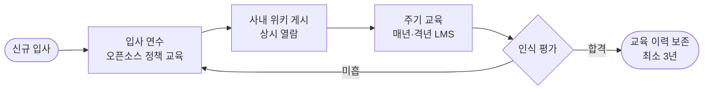
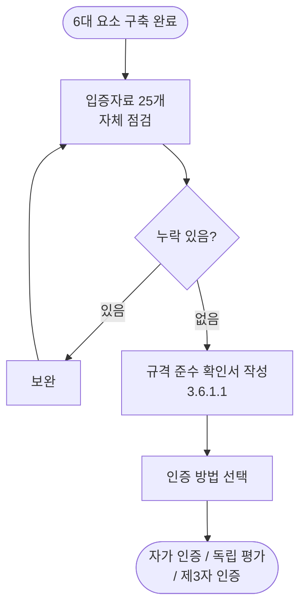

# 2-4 도구 — 규모를 자동화로 해결

<HexCoreElements :active="4" />

<v-click>

수작업은 공급 소프트웨어 수가 늘어나는 순간 무너진다. ISO/IEC 5230 §3.3.1.2와 ISO/IEC 18974 §4.3.1.2가 요구하는 **오픈소스 컴포넌트 기록**을 지속적으로 유지하려면 자동화 도구 환경이 필요하다.

</v-click>

---

# 수작업의 한계 — Before / After

<div class="grid grid-cols-2 gap-8 pt-4">

<div>

### Before — 스프레드시트 수작업

<v-click>

- 빌드 타임 의존성은 소스 스캔으로 잡히지 않음
- 제품·버전이 늘면 누락·중복 발생
- 새 취약점(CVE) 공개 시 영향 파악 불가
- 라이선스 의무 추적이 사람 기억에 의존

</v-click>

</div>

<div>

### After — 자동화 도구 환경

<v-click>

- 의존성 분석으로 전이적 컴포넌트까지 수집
- SBOM 자동 생성·중앙 관리
- 신규 취약점 자동 탐지·알림
- 정책 위반 자동 평가

</v-click>

</div>

</div>

<v-click>

<Callout variant="success">
스프레드시트로도 시작할 수 있으나, 공급 소프트웨어의 수와 버전이 많아지면 수동 관리는 한계에 부딪힌다. 자동화된 오픈소스 도구 도입이 효율적이다.
</Callout>

</v-click>

---

# 거버넌스 도구 생태계 지도

<div class="grid grid-cols-2 gap-6 pt-2 text-sm">

<v-click>

<div>

**① 소스 코드 스캔**
FOSSology · SCANOSS(스니펫 매칭)

**② 의존성 분석**
ORT · FOSSLight Dependency Scanner · cdxgen · Syft

</div>

</v-click>

<v-click>

<div>

**③ 거버넌스 / SBOM 관리**
SW360 · FOSSLight · Dependency-Track

**④ 보안 취약점 관리**
OWASP Dependency-Check · OSV-SCALIBR · SW360 · FOSSLight

</div>

</v-click>

<v-click>

<div>

**⑤ 산출물 생성**
onot(고지문) · FOSSLight

</div>

</v-click>

<v-click>

<div>

**⑥ 산출물 보관·공개**
GitHub Pages · 오픈소스 웹사이트

</div>

</v-click>

</div>

<v-click>

<Callout variant="info">
모든 문제를 푸는 단일 도구는 없다. 공급 소프트웨어의 특성과 요구사항에 맞는 조합을 선택하고, 자동화 결과는 참여자의 전문적 검토와 병행한다.
</Callout>

</v-click>

---

# 소스 스캔 — FOSSology & SCANOSS

<div class="grid grid-cols-2 gap-8 pt-4">

<v-click>

<div>

### FOSSology

Linux Foundation 프로젝트. 웹 기반으로 업로드한 파일에서 라이선스 텍스트와 저작권 정보를 검출하고 리포트를 생성한다.

- 파일 단위 라이선스·저작권 식별
- 대규모 코드베이스 분석
- Docker로 사내 서버 구축 (무료)

</div>

</v-click>

<v-click>

<div>

### SCANOSS

OSSKB(1억+ 파일 인덱싱)와 대조하는 SCA 도구. **스니펫(코드 조각) 단위** 매칭으로 일부만 복사·수정한 코드도 출처를 추적한다.

- 스니펫 수준 매칭
- CycloneDX·SPDX SBOM 자동 생성
- `scanoss-py` CLI + REST API (Apache-2.0)

</div>

</v-click>

</div>

<v-click>

<Callout variant="info">
SCANOSS는 AI 코딩 도구가 생성한 코드의 출처 미상 혼입(§7 AI 컴플라이언스)을 추적하는 데도 유용하다.
</Callout>

</v-click>

---

# SBOM 생성·관리 도구

<div class="grid grid-cols-2 gap-6 pt-2 text-sm">

<v-click>

<div>

### 생성 (CLI)

**cdxgen** — OWASP. 20개+ 언어·생태계, CycloneDX 1.4/1.5/1.6 출력, 컨테이너·저장소 스캔

**Syft** — Anchore. 컨테이너·파일시스템, SPDX·CycloneDX 출력, Grype 취약점 연동

</div>

</v-click>

<v-click>

<div>

### 관리 (플랫폼)

**FOSSLight** — LG전자. SBOM·라이선스·취약점·고지문 일괄 관리, 한국어 가이드

**Dependency-Track** — OWASP. SBOM 기반 지속 모니터링, 정책 엔진, REST API

</div>

</v-click>

</div>

<v-click>

<EvidenceCard number="3.3.1.2" title="공급 소프트웨어의 오픈소스 컴포넌트 기록(SBOM)" standard="5230" clause="§3.3.1" status="full">
ISO/IEC 18974 §4.3.1.2가 동일 요건을 준용한다. SBOM은 NTIA 최소 요소와 SPDX·CycloneDX 표준 형식으로 작성한다.
</EvidenceCard>

</v-click>

---

# 산출물 생성·공개 — onot & 오픈소스 웹사이트

<div class="grid grid-cols-2 gap-8 pt-4">

<v-click>

<div>

### onot — 고지문 자동 생성

SK텔레콤이 공개(카카오 공동 개발). SPDX 형식 SBOM을 입력받아 **오픈소스 고지문(NOTICE)** 으로 자동 변환하는 Python CLI.

```bash
pip install onot
onot -f sbom.spdx
```

cdxgen·Syft가 만든 SBOM을 그대로 입력으로 사용한다.

</div>

</v-click>

<v-click>

<div>

### GitHub Pages 공개

GPL·LGPL은 배포 후 최소 3년간 소스 제공 의무가 있다(§3.4.1.2). GitHub Pages로 고지문·소스를 무료로 보관·공개할 수 있다.

SK텔레콤 오픈소스 웹사이트가 대표 사례이며, 소스가 공개되어 누구나 유사 환경을 구축할 수 있다.

</div>

</v-click>

</div>

---

# CI/CD 연동 — 정책 게이트

<v-click>

스캔을 파이프라인에 내장하면 오픈소스 이슈를 **머지 전에** 자동 차단할 수 있다. 아래는 SCANOSS를 GitHub Actions로 자동화하는 예시다.

</v-click>

<v-click>

<CodeShowcase lang="yaml" filename=".github/workflows/scanoss.yml" highlight="9-12">

```yaml
name: SCANOSS License Scan
on: [push, pull_request]
jobs:
  scan:
    runs-on: ubuntu-latest
    steps:
      - uses: actions/checkout@v4
      - name: Install SCANOSS
        run: pip install scanoss
      - name: Run scan
        run: scanoss-py scan . --output results.json
      - name: Generate SBOM
        run: scanoss-py convert --input results.json --format cyclonedx --output sbom.json
      - name: Upload SBOM
        uses: actions/upload-artifact@v4
        with:
          name: sbom
          path: sbom.json
```

</CodeShowcase>

</v-click>

<v-click>

<Callout variant="info">
Dependency-Track 정책 엔진으로 금지 라이선스(BUSL-1.1·SSPL-1.0 등)는 <code>FAIL</code>, Copyleft(GPL·AGPL 등)는 <code>WARN</code>으로 설정해 게이트를 구성한다.
</Callout>

</v-click>

---

# cdxgen + Dependency-Track 자동화 실습

<v-click>

처음 시작하는 기업은 **cdxgen(SBOM 생성) + Dependency-Track(취약점·라이선스 모니터링)** 조합으로 하루 안에 기본 자동화 환경을 갖출 수 있다.

</v-click>

<v-click>

<CodeShowcase lang="bash" filename="scan-upload.sh" highlight="3,8-13">

```bash
#!/bin/bash
# 사용법: ./scan-upload.sh <프로젝트명> <버전>
API_KEY="${DT_API_KEY:?환경변수 DT_API_KEY를 설정하세요}"

# 1) SBOM 생성 (Dependency-Track v4.14는 CycloneDX 1.6까지 지원)
cdxgen -r --spec-version 1.6 -o sbom.json .

# 2) Dependency-Track 업로드 (프로젝트 자동 생성)
curl -s -X POST "http://localhost:8081/api/v1/bom" \
  -H "X-Api-Key: ${API_KEY}" \
  -F "autoCreate=true" \
  -F "projectName=${1}" \
  -F "projectVersion=${2}" \
  -F "bom=@sbom.json"
```

</CodeShowcase>

</v-click>

<v-click>

<Callout variant="success">
업로드 후 Dependency-Track이 NVD·OSV·GitHub Advisories와 대조해 컴포넌트별 취약점을 지속 모니터링한다.
</Callout>

</v-click>

---

# 2-5 교육 — 사람이 알아야 작동

<HexCoreElements :active="5" />

<v-click>

아무리 훌륭한 정책과 프로세스를 구축해도 구성원이 신경 쓰지 않으면 무용지물이다. 교육은 거버넌스 체계가 실제로 동작하게 만드는 마지막 퍼즐이다.

</v-click>

---

# 교육 — 체계의 마지막 퍼즐

<v-click>

기업은 모든 프로그램 참여자(개발자·배포 엔지니어·품질 엔지니어 등)가 오픈소스 정책의 존재를 인식하고 필요한 활동을 하도록 교육·내부 위키 등 실질적 수단을 제공해야 한다.

</v-click>

<div class="grid grid-cols-2 gap-6 pt-4">

<v-click>

<div>

<EvidenceCard number="3.1.1.2" title="오픈소스 정책 인식 절차" standard="5230" clause="§3.1.1" status="full">
교육·내부 위키 등 문서화된 전달 절차. ISO/IEC 18974 §4.1.1.2가 보안 보증 정책에 대해 동일 요건을 준용한다.
</EvidenceCard>

</div>

</v-click>

<v-click>

<div>

<Callout variant="info" title="인식 평가 4요소 (§3.1.3.1)">
참여자 인식 평가는 다음 4요소를 다뤄야 한다.<br>
① 오픈소스 정책의 존재·위치<br>
② 프로그램의 목표<br>
③ 참여자의 기여 방법<br>
④ 미준수 시 미치는 영향
</Callout>

</div>

</v-click>

</div>

---

# 정책 전파 절차 — 온보딩·위키·LMS

<v-click>



*둥근 사각형 = 시작/종료 · 마름모 = 분기*

</v-click>

<v-click>

<Callout variant="info">
신규 채용자는 입사 연수 시 교육을 의무화하고, 기존 참여자는 매년 또는 격년 주기로 재교육한다. 교육 이력과 평가 결과는 LMS(학습 관리 시스템)에 최소 3년간 보존한다.
</Callout>

</v-click>

---

# 교육 효과 측정·인식 평가

<div class="grid grid-cols-2 gap-8 pt-2 text-sm">

<v-click>

<div>

### 평가 (역량 확인)

각 역할 담당자가 교육·경험으로 자격을 갖추었는지 평가하고 결과를 보관한다.

| 단계 | 내용 |
|------|------|
| 교육 | 필요 역량 교육 제공 |
| 평가 | 교육 기반 평가 수행 |
| 보관 | LMS·HR에 결과 보존 |

</div>

</v-click>

<v-click>

<div>

### 효과성 측정 지표

| 지표 | 측정 |
|------|------|
| 교육 이수율 | 대상 대비 완료 |
| 평가 점수 | 시험 결과 |
| 위반 감소율 | 컴플라이언스 위반 건수 |
| 대응 시간 단축률 | 취약점 대응 |
| 만족도 | 참여자 설문 |

</div>

</v-click>

</div>

<v-click>

<EvidenceCard number="3.1.2.3" title="각 참여자의 역량 평가 문서화된 증거" standard="5230" clause="§3.1.2" status="full">
ISO/IEC 18974 §4.1.2.4가 준용. 참여자가 수백 명 이상이면 온라인 교육·평가 시스템 활용을 권장한다.
</EvidenceCard>

</v-click>

---

# 교육 자료 무료로 시작하기

<v-click>

교육 자료를 처음부터 만드는 것은 부담이다. 국내 우수 기업들이 공개한 자료를 활용하면 빠르게 시작할 수 있다.

</v-click>

<div class="grid grid-cols-3 gap-4 pt-4 text-sm">

<v-click>

<div>

### 엔씨소프트

사내 오픈소스 교육 교안(PPT)과 강의 스크립트를 GitHub에 공개

`github.com/ncsoft/oss-basic-training`

</div>

</v-click>

<v-click>

<div>

### 카카오

사내 개발자용 오픈소스 교육 자료를 PDF로 공개

`opensource_guide_kakao.pdf`

</div>

</v-click>

<v-click>

<div>

### 라이선스 가이드

한국저작권위원회 OLIS · SK텔레콤 라이선스별 의무사항(§3.3.2.1)

`olis.or.kr` · `sktelecom.github.io/guide`

</div>

</v-click>

</div>

<v-click>

<Callout variant="success">
오픈소스 교육에는 기여 정책 인식(§3.5.1.3)도 포함해야 한다. 기여 정책을 모르면 무분별한 기여로 개인·회사에 피해가 발생할 수 있다.
</Callout>

</v-click>

---

# 2-6 준수·개선 — 공식 확인·지속 유지

<HexCoreElements :active="6" />

<v-click>

정책·프로세스·도구·조직·교육을 모두 갖추었다면, 마지막으로 **모든 요구사항을 충족함을 공식 확인**하고 이를 **지속적으로 유지**해야 한다.

</v-click>

---

# 준수 선언이란? — 점검 → 확인서 → 신청/선언

<v-click>



*둥근 사각형 = 시작/종료 · 마름모 = 분기*

</v-click>

<v-click>

<Callout variant="info">
ISO/IEC 5230과 ISO/IEC 18974는 각각 프로그램이 모든 요구사항을 충족함을 확인하는 문서를 요구한다(§3.6.1.1 · §4.4.1.1).
</Callout>

</v-click>

---

# 자가 인증 절차 상세 + 인증 방법 선택

<div class="grid grid-cols-2 gap-8 pt-2 text-sm">

<v-click>

<div>

### 자가 인증 단계

1. 입증자료 25개 전체 **자체 점검**
2. 누락 항목 **보완**
3. OpenChain 온라인 체크리스트 **제출**
4. 준수 기업으로 **등재**

체크리스트: `certification.openchainproject.org` (무료·즉시 시작)

</div>

</v-click>

<v-click>

<div>

### 인증 방법 3종

| 방법 | 비용 | 신뢰도 |
|------|:----:|:------:|
| 자가 인증 | 무료 | 낮음 |
| 독립 평가 | 중간 | 중간 |
| 제3자 인증 | 높음 | 높음 |

제3자 인증 기관(2024): ORCRO · PwC · TÜV SÜD · Synopsys · Bureau Veritas

</div>

</v-click>

</div>

<v-click>

<Callout variant="success" title="단계적 접근 권장">
처음 인증을 준비하는 기업은 <strong>자가 인증 → 독립 평가 → 제3자 인증</strong> 순서로 진행한다. 자가 인증만으로도 많은 공급망 파트너의 요구 수준을 충족할 수 있다.
</Callout>

</v-click>

---

# 인증 후 18개월 유지 — 회고형 시제

<v-click>

<Callout variant="critical" title="시제 주의 — 회고형 확인 (§3.6.2.1 · §4.4.2.1)">
18개월 조항은 <strong>미래형 보장 선언이 아니다.</strong><br>
"앞으로 18개월간 충족하겠다"(❌)가 아니라,<br>
적합성 인증 획득 후 <strong>"지난 18개월 동안 모든 요구사항을 충족해 왔음"</strong>(✅)을 확인하는 <strong>과거 사실 확인 문서</strong>다.
</Callout>

</v-click>

<v-click>

이를 입증하려면 18개월 주기 동안 다음 활동의 기록이 필요하다.

- 최소 6개월마다 내부 감사 — 요구사항 충족 여부 확인
- 연 1회 이상 외부 전문가 검토 — 프로그램 효과성 평가
- 지속적 교육·역량 평가, 정책·프로세스 정기 검토·갱신

</v-click>

<v-click>

<Callout variant="warning">
다음 재확인 예정일을 문서에 명시한다. 18개월 주기를 지키지 못하면 적합성 인증 효력이 상실될 수 있다.
</Callout>

</v-click>

---

# 성과 메트릭·지속 개선·모범 사례 검증 (★18974)

<v-click>

ISO/IEC 18974는 5230 대비 **측정 가능한 목표와 지속적 개선 증거**를 추가로 요구한다(★ 전용 항목, Documented Evidence 강도).

</v-click>

<v-click>

| 메트릭 (§4.1.4.2) | 목표 | 주기 |
|------------------|:----:|:----:|
| SBOM 완전성 | 100% | 분기 |
| Critical 취약점 평균 대응 시간 | 7일 이하 | 분기 |
| High 취약점 평균 대응 시간 | 30일 이하 | 분기 |
| 취약점 재발생률 | 10% 이하 | 반기 |
| 외부 문의 응답 준수율 | 95% 이상 | 분기 |

</v-click>

<v-click>

<Callout variant="warning" title="★ Documented Evidence (§4.1.4.3 · §4.1.2.6)">
지속적 개선(§4.1.4.3)은 검토·감사 회의록이, 내부 모범 사례 일치 검증(§4.1.2.6)은 비교 결과와 <strong>담당자 지정</strong> 기록이 실제로 보관되어야 한다. 절차 문서만으로는 부족하다.
</Callout>

</v-click>

---

# 5230 + 18974 통합 준수 체크 — 입증자료 매핑

<v-click>

준수 선언 단계에서 다루는 입증자료를 표준별로 매핑한다. 두 표준은 **각 25개, 합계 50개**이며 공통 16개가 중복된다(고유 34개). 공통 16개는 5230 기반 파생, 18974 전용 9개는 더 강한 Documented Evidence를 요구한다.

</v-click>

<div class="grid grid-cols-3 gap-3 pt-2">

<v-click>

<EvidenceCard number="3.6.1.1" title="전체 요구사항 충족 확인 문서" standard="5230" clause="§3.6.1" status="full" />

</v-click>

<v-click>

<EvidenceCard number="3.6.2.1" title="18개월 내 충족 확인 문서" standard="5230" clause="§3.6.2" status="full" />

</v-click>

<v-click>

<EvidenceCard number="3.2.2.5" title="미준수 검토·시정 절차" standard="5230" clause="§3.2.2" status="full" />

</v-click>

<v-click>

<EvidenceCard number="4.4.1.1" title="전체 요구사항 충족 확인" standard="18974" clause="§4.4.1" status="full" />

</v-click>

<v-click>

<EvidenceCard number="4.4.2.1" title="18개월 내 충족 확인" standard="18974" clause="§4.4.2" status="full" />

</v-click>

<v-click>

<EvidenceCard number="4.1.4.2" title="성과 메트릭 세트 ★" standard="18974" clause="§4.1.4" status="full" />

</v-click>

</div>

---

# 파트 2 요약 — 6대 요소 종합

<HexCoreElements />

<v-click>

<div class="pt-4 text-center">

**조직**으로 책임을 정하고 → **정책**으로 기준을 세우고 → **프로세스**로 작동시키고 → **도구**로 규모를 감당하고 → **교육**으로 사람에게 전파하고 → **준수**로 공식 확인·지속 유지한다.

</div>

</v-click>

<v-click>

<Callout variant="success">
6대 요소가 맞물려 ISO/IEC 5230(라이선스 컴플라이언스)과 ISO/IEC 18974(보안 보증)의 입증자료를 충족하는 살아있는 거버넌스 체계가 완성된다.
</Callout>

</v-click>
