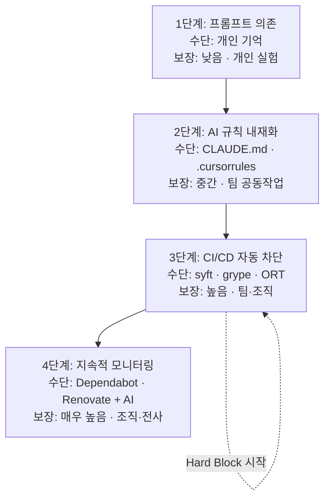
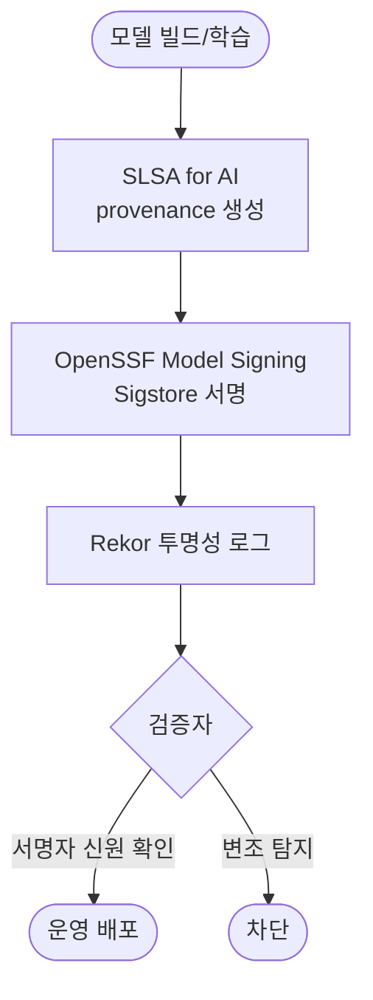

# Part 3 — AI 컴플라이언스

<div class="text-2xl opacity-90 mt-4">기존 거버넌스 체계의 AI 확장</div>

<div class="pt-10 opacity-75">
  ISO/IEC 5230 · 18974 → 42001 · OSAID · AI SBOM · AI 코딩 · 모델 공급망 — <strong>75분</strong>
</div>

---

# 기존 거버넌스로 충분한가?

ISO/IEC 5230 · 18974 체계가 이미 있다면, AI 시스템의 **상당 부분**은 그대로 커버됩니다.
하지만 AI 고유의 영역은 기존 프로세스가 닿지 않습니다.

<div class="grid grid-cols-2 gap-6 mt-4">
<div>

### 기존 체계가 커버하는 영역

<v-click>

- AI **프레임워크·라이브러리** 라이선스 (PyTorch·TF·Transformers)
- 일반 패키지 SBOM · CVE 모니터링
- 컴플라이언스 산출물·고지문 생성
- 정책·교육·준수 선언 체계

</v-click>
</div>
<div>

### AI가 새로 가져오는 영역

<v-click>

- **사전 훈련 모델**의 커스텀 라이선스 (Llama·Gemma)
- **학습 데이터셋** 라이선스 의무
- **AI SBOM**(모델·데이터셋 포함)
- **AI 코딩 도구**의 라이선스 혼입·저작권 귀속
- **모델 공급망** 공격(Pickle RCE·Model Poisoning)

</v-click>
</div>
</div>

<v-click>

<Callout variant="info" title="이 파트의 출발점">
AI 컴플라이언스는 새로운 별도 체계가 아니라, 기존 ISO 5230 · 18974 체계의 <strong>자연스러운 확장</strong>입니다. 기존 프로세스를 재사용하고, AI 고유 영역만 추가합니다.
</Callout>

</v-click>

---

# 글로벌 AI 규제·표준 매트릭스 (2026-05)

조직 맥락(ISO/IEC 42001 §4.1) 분석 시 외부 이슈로 매핑해야 할 규제·표준입니다.

<div class="text-xs">

| 규제·표준 | 시행 시점 | 핵심 의무 | 오픈소스 교차점 |
|----------|-----------|----------|---------------|
| **EU AI Act §53** (GPAI) | 2026-08 단계적 | 학습 데이터 요약 공개·저작권 옵트아웃 존중·기술 문서 | 학습 데이터셋 라이선스·출처 추적 |
| **EU AI Act §50** | 2026-08 | AI 생성 콘텐츠 라벨링·투명성 | AI 코딩 도구 출력물 표시 |
| **EU AI Act §40** | 2026-08 | 에너지 소비 보고 | AI SBOM `energyConsumption` 필드 |
| **EU AI Act §25** | 2026-08 | 가치사슬 의무(다운스트림에 정보 제공) | 외부 모델 도입 시 공급자 정보 수령 |
| **EU AI Act §11 + Annex IV** | 2027 (고위험) | 기술 문서 작성 의무 | AI SBOM이 기술 문서 핵심 요소 |
| **한국 AI 기본법** | **2026-01 시행** | 고영향 AI 분류·영향 평가·AI 시스템 표시·학습 데이터 출처 공개 | AI SBOM·모델 카드 작성 |
| **US Copyright Office AI 가이드** | 2023 발행·2024 갱신 | 완전 AI 생성물 = 인간 저작자성 부재(등록 불가) | AI 코딩 도구 출력물 저작권 귀속 |
| **US EO 14110** (2023) | 시행 중 | 연방 AI SBOM 요건·이중 사용 모델 보고 | AI SBOM 표준화·NIST AI RMF |
| **NIST AI RMF 2.0** | 2024 발행 | AI 리스크 관리 프레임워크(GOVERN·MAP·MEASURE·MANAGE) | ISO/IEC 42001과 상호 보완 |
| **OSAID 1.0** (OSI 2024-10) | 발효 | "오픈소스 AI 모델" 정의(데이터·코드·가중치 3요소) | Open Weight(Llama·Gemma)는 미충족 |
| **ISO/IEC 42005** (2025) | 발행 | AI 영향 평가 표준 | §6.1.4 영향 평가 구체 기법 |
| **ISO/IEC 42006** | 2026 발효 | AI 인증기관 요구사항 | 3자 인증 신뢰성(ISO 17021-1 기반) |

</div>

<div class="oc-caption mt-1">출처: iso42001_guide §4.1 글로벌 AI 규제·표준 매트릭스 (2026-05 기준, 본 가이드 전체 참조 기준)</div>

---

# AI 시스템에서 오픈소스가 쓰이는 3대 영역

AI 시스템은 세 층위에서 오픈소스를 활용하며, 각 층위마다 관리 방법이 다릅니다.

<div class="grid grid-cols-3 gap-5 mt-6">
<v-click>
<div class="oc-card">

### ① 프레임워크·라이브러리

PyTorch · TensorFlow · Hugging Face Transformers · LangChain · scikit-learn

→ **일반 오픈소스 라이선스 컴플라이언스** 그대로 적용 (ISO/IEC 5230)

</div>
</v-click>
<v-click>
<div class="oc-card">

### ② 사전 훈련 모델

Llama · Mistral · Falcon · Gemma · DeepSeek · BERT

→ **모델별 커스텀 라이선스** 개별 확인 필요 (OSAID vs Open Weight)

</div>
</v-click>
<v-click>
<div class="oc-card">

### ③ 학습 데이터셋

Common Crawl · Wikipedia · CC-BY 데이터셋 · 파인튜닝 데이터

→ **오픈 데이터 라이선스** 의무 이행 (NC 조건 주의)

</div>
</v-click>
</div>

<v-click>

<Callout variant="success" title="ISO/IEC 5230 · 18974 적용">
세 영역 모두 SBOM에 컴포넌트·버전을 포함하고, 각 라이선스 의무(저작권 고지·변경 고지 등)를 이행합니다. FOSSology·FOSSLight 등 기존 스캔 도구로 AI 코드 저장소도 동일하게 분석합니다.
</Callout>

</v-click>

---
layout: stat
---

# EU CRA — 취약점 보고 의무·AI 제품 투명성

EU Cyber Resilience Act(CRA)는 AI 제품을 포함한 디지털 제품에 **취약점 보고 시한**과
**컴포넌트 투명성**을 의무화합니다.

<div class="grid grid-cols-3 gap-5 mt-6">
<v-click>
<div class="oc-card text-center">
<div class="oc-stat">24h</div>
<div class="mt-2"><strong>조기 경보</strong></div>
<div class="oc-caption">악용 중인 취약점 인지 후 ENISA·CSIRT에 조기 경보</div>
</div>
</v-click>
<v-click>
<div class="oc-card text-center">
<div class="oc-stat">72h</div>
<div class="mt-2"><strong>취약점 통보</strong></div>
<div class="oc-caption">취약점 상세 통보(영향·완화 조치 포함)</div>
</div>
</v-click>
<v-click>
<div class="oc-card text-center">
<div class="oc-stat">14d</div>
<div class="mt-2"><strong>최종 보고서</strong></div>
<div class="oc-caption">사고 처리 종료 후 최종 보고서 제출</div>
</div>
</v-click>
</div>

<v-click>

<Callout variant="critical" title="AI 제품의 CRA 투명성 의무">
CRA는 AI 제품에 <strong>컴포넌트 목록(SBOM)</strong>과 <strong>취약점 추적</strong>을 요구합니다. AI SBOM은 모델·데이터셋·프레임워크 구성을 투명하게 공개해 이 의무를 충족하는 핵심 수단입니다. AI 시스템에 포함된 오픈소스 컴포넌트의 취약점도 동일한 시한 체계로 보고 대상이 됩니다.
</Callout>

</v-click>

<div class="oc-caption mt-1">출처: iso42001_guide/4-operation/2-ai-sbom (CRA AI 제품 투명성), iso18974_guide/2-relevant-tasks/1-access</div>

---

# AI 프레임워크 라이선스 관리

AI 개발에 쓰는 오픈소스 프레임워크·라이브러리는 일반 소프트웨어와 **동일하게**
ISO/IEC 5230 오픈소스 관리 프로세스를 적용합니다.

<div class="grid grid-cols-2 gap-6 mt-4">
<div>

### 기존 프로세스 재사용

<v-click>

- SBOM에 모든 AI 프레임워크·라이브러리와 버전 포함
- 각 라이선스 의무(저작권 고지·변경 고지) 이행
- FOSSology·FOSSLight 등 기존 스캔 도구로 분석
- CVE 모니터링·취약점 대응(ISO/IEC 18974)도 동일 적용

</v-click>
</div>
<div>

<v-click>

<Callout variant="success" title="새 도구·새 절차 불필요">
프레임워크 영역은 AI라고 해서 별도 체계가 필요하지 않습니다. 이미 운영 중인 라이선스 컴플라이언스·보안 보증 프로세스를 AI 코드 저장소에 그대로 확장하면 됩니다.
</Callout>

</v-click>

<v-click>

<Callout variant="info" title="주의가 필요한 지점">
프레임워크의 <strong>플러그인·확장 모듈</strong>은 본체와 다른 라이선스일 수 있습니다(예: 일부 모델 변환 도구). 의존성 트리 전체를 스캔합니다.
</Callout>

</v-click>
</div>
</div>

---

# AI 프레임워크 주요 라이선스

핵심 AI 프레임워크는 대부분 허용형(permissive) 라이선스라 상업적 사용에 제약이 적습니다.

| 프레임워크 | 라이선스 | 상업적 사용 | 주요 의무 |
|-----------|---------|:----------:|---------|
| PyTorch | `BSD-3-Clause` | ✅ 가능 | 저작권 표시 |
| TensorFlow | `Apache-2.0` | ✅ 가능 | 저작권 표시, 변경 고지 |
| Hugging Face Transformers | `Apache-2.0` | ✅ 가능 | 저작권 표시 |
| LangChain | `MIT` | ✅ 가능 | 저작권 표시 |
| scikit-learn | `BSD-3-Clause` | ✅ 가능 | 저작권 표시 |

<v-click>

<Callout variant="success" title="허용형 라이선스의 공통 의무">
`Apache-2.0`·`MIT`·`BSD-3-Clause`는 모두 상업적 사용이 자유롭지만, <strong>저작권·라이선스 고지문 동봉</strong>은 공통 의무입니다. `Apache-2.0`은 변경 시 변경 고지 의무가 추가되며, 특허 보호 조항(§3)을 포함합니다.
</Callout>

</v-click>

<div class="oc-caption mt-1">출처: opensource_for_enterprise/7-ai-compliance §2(1)</div>

---

# 오픈소스 AI 모델 관리 — OSAID vs Open Weight

사전 훈련 모델은 일반 라이브러리와 다른 **커스텀 라이선스**를 쓰는 경우가 많습니다.
"오픈소스 AI 모델"과 "Open Weight 모델"을 명확히 구분해야 합니다.

<div class="grid grid-cols-2 gap-6 mt-4">
<v-click>
<div>

### OSAID 1.0 (OSI, 2024-10)

학습 **데이터** · 학습 **코드** · 모델 **가중치** 3요소가 모두 OSI 승인 오픈소스 라이선스로 공개된 모델만 "오픈소스 AI 모델"로 인정.

<div class="oc-caption">→ 데이터·코드·가중치 = 3요소 완전 공개</div>

</div>
</v-click>
<v-click>
<div>

### Open Weight 모델

**가중치만** 공개되고 학습 데이터·코드는 비공개, 또는 사용 제한 조건이 있는 모델.

<div class="oc-caption">→ Llama · Gemma · Falcon 180B 등이 해당</div>

</div>
</v-click>
</div>

<v-click>

<Callout variant="warn" title="심사·검토 시 반드시 답할 수 있어야 할 질문">
"이 모델은 OSAID 기준 <strong>오픈소스</strong>인가, <strong>Open Weight</strong>인가?" — Llama·Gemma는 흔히 "오픈소스 모델"로 불리지만 OSAID 1.0 기준으로는 Open Weight입니다. 컴플라이언스 검토 시 이 구분을 명확히 문서화합니다.
</Callout>

</v-click>

<div class="oc-caption mt-1">출처: opensource_for_enterprise/7-ai-compliance §2(2), iso42001_guide/1-context-leadership</div>

---

# OSAID 1.0 정의 + Open Weight 구분

OSAID 1.0이 요구하는 "오픈소스 AI" 3요소와, Open Weight가 미충족하는 지점을 구체화합니다.

<div class="grid grid-cols-3 gap-5 mt-6">
<v-click>
<div class="oc-card">

### 데이터 (Data)

학습에 사용한 데이터, 또는 데이터를 확보·재현할 수 있는 **충분히 상세한 정보**

<div class="oc-caption mt-2">Open Weight: 대부분 <strong>비공개</strong></div>

</div>
</v-click>
<v-click>
<div class="oc-card">

### 코드 (Code)

학습·추론에 사용한 **소스 코드** (전처리·학습 스크립트 포함)

<div class="oc-caption mt-2">Open Weight: 학습 코드 <strong>비공개</strong> 多</div>

</div>
</v-click>
<v-click>
<div class="oc-card">

### 가중치 (Weights)

모델 **파라미터·가중치** (OSI 승인 라이선스로 공개)

<div class="oc-caption mt-2">Open Weight: 공개하나 <strong>사용 제한</strong></div>

</div>
</v-click>
</div>

<v-click>

<Callout variant="warn" title="Open Weight가 OSAID를 미충족하는 이유">
Llama·Gemma·Falcon 180B는 가중치를 공개하지만 (1) 학습 데이터·코드 비공개, (2) MAU·AUP 등 사용 제한 조건 때문에 OSAID 1.0의 "오픈소스 AI" 정의를 충족하지 못합니다. 따라서 비교표·SBOM에서 OSAID 열을 "⚠️ Open Weight"로 분류합니다.
</Callout>

</v-click>

<div class="oc-caption mt-1">출처: opensource_for_enterprise/7-ai-compliance §2(2), iso42001_guide §4.1 (OSAID 1.0)</div>

---

# AI 모델 라이선스 유형 비교표 (2026 모델)

2026-05 시점 산업 주력 모델을 OSAID 1.0 기준으로 분류합니다.

<div class="text-sm">

| 라이선스 유형 | 대표 모델 (2026) | OSAID 1.0 | 상업적 사용 | 파생 모델 공개 |
|-------------|-----------------|:---------:|:----------:|:-----------:|
| `Apache-2.0` | Mistral 7B, Qwen 2.5 / Qwen 3, Falcon 7B/40B | ✅ 적합 | ✅ 가능 | ❌ 불필요 |
| `MIT` | DeepSeek-V3 / DeepSeek-R1, Phi-4, GPT-J | ✅ 적합 | ✅ 가능 | ❌ 불필요 |
| Meta Llama Community License | Llama 3.1 / 3.3 / 4 | ⚠️ Open Weight | 조건부 (MAU 7억 이하 무료) | ❌ 불필요 |
| Gemma Terms of Use v3 | Gemma 3 | ⚠️ Open Weight | 조건부 (AUP 동의) | ❌ 불필요 |
| TII Falcon 180B License | Falcon 180B | ⚠️ Open Weight | 상업 사용 별도 조건 | 사용 약관 확인 |
| `CC-BY-4.0` | 일부 학술 모델 | ⚠️ 데이터 한정 | ✅ 가능 | 저작자 표시 필요 |
| `CC-BY-NC-4.0` | 일부 연구 모델 | ❌ 비상업 한정 | ❌ 비상업적 한정 | — |

</div>

<v-click>

<Callout variant="warn" title="모델 라이선스는 개별·버전별 확인 필수">
AI 모델 라이선스는 표준화되어 있지 않아 모델마다 조건이 다릅니다. Hugging Face 모델 카드(Model Card)에서 라이선스를 직접 확인하고, 같은 계열도 <strong>버전별 본문 차이</strong>(예: Llama 2 / 3 / 3.1 / 3.3 / 4)를 검토합니다.
</Callout>

</v-click>

<div class="oc-caption mt-1">출처: opensource_for_enterprise/7-ai-compliance §2(2) (2026-05 기준)</div>

---

# Llama 라이선스 의무 체크리스트

Meta Llama Community License 적용 모델(Llama 3.1·3.3·4 등) 사용 시 다음 의무를 **모두** 이행합니다.

<div class="grid grid-cols-2 gap-x-8 gap-y-2 mt-4 text-sm">
<v-click>
<div>☑ <strong>MAU 7억 명 임계 확인</strong> — 자사·계열사 월간 활성 사용자(MAU) 7억 명 초과 시 별도 Meta 라이선스 협상 필요</div>
</v-click>
<v-click>
<div>☑ <strong>"Built with Llama" 표기</strong> — 파생 모델 또는 Llama 활용 서비스에 표기 의무</div>
</v-click>
<v-click>
<div>☑ <strong>파생 모델명 "Llama" 접두어</strong> — 배포 시 모델명에 "Llama" 포함 (예: `Llama-3-Custom-Finetuned`)</div>
</v-click>
<v-click>
<div>☑ <strong>Acceptable Use Policy(AUP) 동의</strong> — 사용 약관 동의 및 조직 내 전파</div>
</v-click>
<v-click>
<div>☑ <strong>금지 사용 영역 차단</strong> — 군사·핵·생물학·화학 무기, 사이버 공격, 차별 등 금지(AUP 명시)</div>
</v-click>
<v-click>
<div>☑ <strong>405B 등 대규모 모델 재배포 제한 확인</strong> — Llama 3 405B 등 일부 모델은 가중치 재배포 시 추가 조건</div>
</v-click>
<v-click>
<div class="col-span-2">☑ <strong>버전별 라이선스 차이 확인</strong> — Llama 2 / 3 / 3.1 / 3.3 / 4 각 버전마다 라이선스 본문이 다름</div>
</v-click>
</div>

<v-click>

<Callout variant="info" title="확인처">
상세 의무는 <a href="https://www.llama.com/llama-downloads/">Meta Llama 라이선스 공식 페이지</a>에서 확인합니다. 커스텀 라이선스이므로 자동 분류 도구로는 검토 불가 — 법무 검토를 권장합니다.
</Callout>

</v-click>

<div class="oc-caption mt-1">출처: opensource_for_enterprise/7-ai-compliance §2(2)</div>

---

# 학습 데이터셋 라이선스

AI 모델 학습에 사용한 데이터셋에 오픈 데이터·크리에이티브 커먼즈 라이선스가
적용된 경우 해당 조건을 이행해야 합니다.

<div class="grid grid-cols-2 gap-6 mt-4">
<div>

| 라이선스 | 저작자 표시 | 상업적 사용 | 동일조건 변경허락 |
|---------|:----------:|:----------:|:-----------------:|
| `CC0` | ❌ | ✅ | ❌ |
| `CC-BY-4.0` | ✅ | ✅ | ❌ |
| `CC-BY-SA-4.0` | ✅ | ✅ | ✅ |
| `CC-BY-NC-4.0` | ✅ | ❌ 비상업 | ❌ |

</div>
<div>

<v-click>

<Callout variant="critical" title="NC 학습 → 상업 배포 리스크 격상">
<code>CC-BY-NC-4.0</code> 데이터셋으로 파인튜닝한 모델을 <strong>상업 서비스</strong>에 사용하면 라이선스 위반입니다. NC 데이터의 비상업 제한은 파생 모델로 <strong>전이될 수 있어</strong>, 학습 단계의 데이터 선택이 배포 단계의 적법성을 좌우합니다.
</Callout>

</v-click>

<v-click>

- AI SBOM에 학습 데이터셋과 라이선스 기록
- `CC-BY` 계열 사용 시 모델 카드·시스템 문서에 출처 명시
- `CC-BY-SA` 데이터 학습 시 파생 모델 라이선스 처리를 법무팀과 협의

</v-click>
</div>
</div>

<div class="oc-caption mt-1">출처: opensource_for_enterprise/7-ai-compliance §2(3)</div>

---

# 외부 AI 모델 조달 — §8.8 검증 체크리스트

ISO/IEC 42001 §8.8은 외부에서 조달하는 AI 모델에 라이선스·보안·공급망 리스크 검증을 요구합니다.

<div class="grid grid-cols-3 gap-5 mt-4">
<v-click>
<div class="oc-card">

### ① 라이선스 검증

<EvidenceCard number="§8.8-L" title="라이선스 검증" standard="42001" clause="§8.8" />

- 라이선스 유형·원문 URL·**버전** 확인
- 상업 사용 조건(MAU·매출 제한)
- 파인튜닝·재배포·표시 의무
- 비표준 라이선스 → 법무 검토

</div>
</v-click>
<v-click>
<div class="oc-card">

### ② 보안 검증

<EvidenceCard number="§8.8-S" title="보안 검증" standard="42001" clause="§8.8" />

- 공식 namespace 정확 일치(typo-squatting)
- 파일 해시(SHA-256) 검증·SBOM 기록
- Safetensors 우선(pickle 격리 검증)
- CVE 조회(NVD·OSV.dev)·백도어 점검

</div>
</v-click>
<v-click>
<div class="oc-card">

### ③ 공급망 리스크

<EvidenceCard number="§8.8-C" title="공급망 리스크 평가" standard="42001" clause="§8.8" />

- 공급자 신뢰도·커뮤니티 평판
- 유지보수 활성도(업데이트·이슈)
- 라이선스 변경 이력
- 대안 모델 식별(전환 대비)

</div>
</v-click>
</div>

<div class="oc-caption mt-2">출처: iso42001_guide/4-operation/3-supply-chain §3</div>

---

# AI-BOM(AI SBOM)이란?

**AI SBOM(AI System Bill of Materials)** 은 AI 시스템 구성 요소와 그 출처·라이선스를
문서화한 것입니다. 소프트웨어 SBOM(ISO/IEC 5230 §3.3.1)을 AI 시스템으로 확장한 개념으로,
ISO/IEC 42001 §7.5(문서화) 요구사항의 핵심 산출물입니다.

<div class="grid grid-cols-2 gap-6 mt-4">
<div>

### 소프트웨어 SBOM vs AI SBOM

| 항목 | 소프트웨어 SBOM | AI SBOM |
|------|---------------|---------|
| 포함 대상 | 라이브러리·패키지 | 프레임워크 + 모델 + 데이터셋 |
| 라이선스 | SPDX 표준 | SPDX + AI 커스텀(Llama·Gemma) |
| 표준 형식 | SPDX 2.x · CycloneDX 1.4 | **SPDX 3.0 · CycloneDX 1.6** |
| 추가 정보 | 없음 | 파라미터 수·학습 데이터 출처·목적 |
| 관련 ISO | ISO/IEC 5230 §3.3.1 | ISO/IEC 42001 §7.5 |

</div>
<div>

<v-click>

<Callout variant="info" title="용어 통일: AI-BOM = AI SBOM">
"AI-BOM"과 "AI SBOM"은 같은 대상을 가리킵니다. 본 가이드는 <strong>AI SBOM</strong>으로 통일합니다.
</Callout>

</v-click>

<v-click>

<Callout variant="success" title="왜 필요한가 — 투명성과 규제 대응">
ISO/IEC 42001 Appendix C.2.11(투명성·설명 가능성), EU AI Act 고위험 기술 문서, EU CRA 컴포넌트 투명성 의무를 동시에 충족하는 핵심 수단입니다.
</Callout>

</v-click>
</div>
</div>

<div class="oc-caption mt-1">출처: iso42001_guide/4-operation/2-ai-sbom §1</div>

---

# AI SBOM 구성요소 5종 + Fact Sheet

AI SBOM은 일반 SBOM 항목에 더해 모델·데이터셋 고유 메타데이터와 Fact Sheet를 포함합니다.

<div class="grid grid-cols-2 gap-6 mt-4 text-sm">
<div>

<v-click>

**① 프레임워크·라이브러리** — `name`·`version`·`license`·PURL·hash (일반 SBOM과 동일)

</v-click>

<v-click>

**② 사전 훈련 모델** — `primaryPurpose`(inference/training/fine-tuning), `modelCard` URL, `baseModel`(파인튜닝 원본)

</v-click>

<v-click>

**③ 학습 데이터셋** — `dataCollectionProcess`, `dataType`(text/image/audio), `knownBias`

</v-click>

<v-click>

**④ 파인튜닝 데이터** (해당 시) — `name`·`license`·`source`·`dataType`

</v-click>
</div>
<div>

<v-click>

<Callout variant="info" title="⑤ Fact Sheet (AI 시스템 카드) ★">
AI 시스템의 투명성·설명 가능성을 제공하는 문서입니다.

- 편향(bias) 정보 및 한계 사항
- 데이터 출처 및 가용성
- 모델 성능·평가 결과 요약
- 의도된 사용 목적 / 금지 사용 목적
- 안전성·보안 알려진 이슈

ISO/IEC 42001 Appendix C.2.11과 EU AI Act 고위험 기술 문서 요건을 충족합니다. OpenChain AI WG은 Fact Sheet를 AI SBOM 표준 구성요소로 포함 추진 중입니다.
</Callout>

</v-click>
</div>
</div>

<div class="oc-caption mt-1">출처: iso42001_guide/4-operation/2-ai-sbom §2</div>

---

# SPDX 3.0 AI Profile + CycloneDX 1.6 ML-BOM

두 형식이 사실상 산업 표준이며 **보완 관계**입니다. 조직은 한쪽 또는 양쪽을 채택합니다.

<div class="grid grid-cols-2 gap-6 mt-4">
<div>

### SPDX 3.0 AI Profile

`AIPackage` 클래스 · 2024-04 발표 · ISO/IEC 5962 후속

**핵심 강점**: 라이선스·저작권 표현 강함

핵심 필드 12종(발췌):
`typeOfModel` · `modelArchitecture` · `hyperparameter` · `informationAboutTraining` · `metric` · `limitation` · `safetyRiskAssessment` · `autonomyType`

</div>
<div>

### CycloneDX 1.6 ML-BOM

`modelCard` · 2024-04 발표 · ECMA-424 표준

**핵심 강점**: 보안·윤리·성능 메타데이터 풍부

modelCard 4영역:
`modelParameters`(구성 7필드) · `quantitativeAnalysis`(성능 2필드) · `considerations`(윤리·운영 7필드) · `properties`(자유 key-value)

</div>
</div>

<v-click>

<Callout variant="success" title="SPDX 3.0 · CycloneDX 1.6 동시 발행 권장">
EU AI Act 고위험 기술 문서 요건과 ISO/IEC 42003 요구사항을 동시 충족하려면 SPDX 3.0(라이선스 추적)과 CycloneDX 1.6 ML-BOM(보안·윤리 추적)을 <strong>동시 발행</strong>하는 것을 권장합니다. 두 형식은 컴포넌트 ID(PURL 또는 `modelCard.bom-ref`)로 연결됩니다.
</Callout>

</v-click>

<div class="oc-caption mt-1">출처: iso42001_guide/4-operation/2-ai-sbom §3</div>

---

# AI SBOM 예시 — SPDX 3.0 (relationships TRAINED_ON)

모델과 학습 데이터셋의 관계를 `relationships`의 `TRAINED_ON`으로 표현합니다.

<CodeShowcase lang="yaml" filename="ai-sbom.spdx.yaml">

```yaml {17-22,29-35}
spdxVersion: SPDX-3.0
SPDXID: SPDXRef-DOCUMENT
name: "MyAI-Service AI SBOM"
dataLicense: CC0-1.0
createdBy:
  - type: Tool
    identifier: "cdxgen-10.0"

packages:
  - SPDXID: SPDXRef-transformers          # ① 프레임워크
    name: transformers
    versionInfo: "4.40.0"
    licenseConcluded: Apache-2.0
    primaryPurpose: library

  - SPDXID: SPDXRef-llama3-8b             # ② 사전 훈련 모델
    name: meta-llama/Llama-3.1-8B-Instruct
    versionInfo: "3.1"
    licenseConcluded: LicenseRef-Meta-Llama-Community-License
    primaryPurpose: inference
    modelCard: "https://huggingface.co/meta-llama/Llama-3.1-8B-Instruct"
    hyperparameter:
      contextWindow: 131072

  - SPDXID: SPDXRef-dataset-alpaca-korean # ③ 파인튜닝 데이터셋
    name: beomi/KoAlpaca-v1.1a
    licenseConcluded: CC-BY-NC-4.0
    primaryPurpose: trainData

relationships:
  - spdxElementId: SPDXRef-llama3-8b
    relationshipType: TRAINED_ON
    relatedSpdxElement: SPDXRef-dataset-alpaca-korean
```

</CodeShowcase>

<Callout variant="warn" title="CC-BY-NC 데이터셋 주의 (예시의 함정)">
위 <code>KoAlpaca-v1.1a</code>는 <code>CC-BY-NC-4.0</code> — <strong>비상업 전용</strong>입니다. 예시는 형식 설명용이며, 상업 서비스는 `Apache-2.0`·`MIT`·`CC-BY-4.0`·`CC0` 데이터셋을 사용합니다.
</Callout>

<div class="oc-caption mt-1">출처: iso42001_guide/4-operation/2-ai-sbom §3.2</div>

---

# AI SBOM 예시 — CycloneDX 1.6 ML-BOM (modelCard 4영역)

`modelCard`에 모델 구성·성능·윤리 메타데이터를 담습니다.

<CodeShowcase lang="json" filename="ml-bom.cdx.json">

```json {9-14,15-20,21-29}
{
  "bomFormat": "CycloneDX",
  "specVersion": "1.6",
  "components": [{
    "type": "machine-learning-model",
    "name": "Meta Llama 3.1 8B Instruct",
    "licenses": [{ "license": { "name": "Llama 3.1 Community License" } }],
    "modelCard": {
      "modelParameters": {
        "approach": { "type": "supervised" },
        "task": "text-generation",
        "architectureFamily": "transformer",
        "datasets": [{ "ref": "ds-meta-pretrain-15T" }]
      },
      "quantitativeAnalysis": {
        "performanceMetrics": [
          { "type": "MMLU", "value": "0.78" },
          { "type": "HumanEval", "value": "0.65" }
        ]
      },
      "considerations": {
        "technicalLimitations": ["Hallucinates on dates after 2024-12"],
        "ethicalConsiderations": [{ "name": "Prompt injection", "mitigation": "Input filtering" }],
        "environmentalConsiderations": {
          "energyConsumptions": [
            { "activity": "inference", "energyMeasure": { "value": 0.5, "unit": "kWh" } }
          ]
        }
      }
    }
  }]
}
```

</CodeShowcase>

<Callout variant="info" title="environmentalConsiderations — CycloneDX 1.6 신설">
전력 소비·탄소 배출을 기록하는 <code>environmentalConsiderations</code>는 1.6에서 신설되어 EU AI Act §40(에너지 소비 보고)에 직접 대응합니다.
</Callout>

<div class="oc-caption mt-1">출처: iso42001_guide/4-operation/2-ai-sbom §3.3~3.4</div>

---

# AI SBOM 생성 도구 실습

기존 SBOM 도구로 AI 의존성을 추출하고, AI 특화 필드는 추가 작성합니다.

<CodeShowcase lang="bash" filename="ai-sbom-generate.sh">

```bash
# 1. cdxgen — Python AI 프로젝트 의존성 → CycloneDX
cdxgen -t python ./my-ai-project -o ai-sbom.json
cdxgen -t pypi -r requirements.txt -o ai-sbom.json

# 2. Syft — AI 서비스 컨테이너 이미지 전체 → SPDX
syft my-ai-service:latest -o spdx-json=ai-container-sbom.json

# 3. Dependency-Track — AI SBOM 업로드 → 지속적 취약점 모니터링
curl -X POST "http://dtrack:8080/api/v1/bom" \
  -H "X-Api-Key: ${DTRACK_API_KEY}" \
  -F "bom=@ai-sbom.json" \
  -F "projectName=MyAI-Service" \
  -F "projectVersion=1.0.0"
```

</CodeShowcase>

<div class="grid grid-cols-3 gap-4 mt-2 text-sm">
<v-click>
<div><strong>cdxgen</strong> — 의존성 추출(CycloneDX). AI 특화 필드는 별도 추가</div>
</v-click>
<v-click>
<div><strong>Syft</strong> — 컨테이너 이미지 전체 스캔(SPDX)</div>
</v-click>
<v-click>
<div><strong>Dependency-Track</strong> — SBOM 보관 + CVE 지속 모니터링</div>
</v-click>
</div>

<div class="oc-caption mt-1">출처: iso42001_guide/4-operation/2-ai-sbom §4</div>

---

# ISO/IEC 42001 오픈소스 교차 조항 6개

ISO/IEC 42001 전체 중 오픈소스 관리와 직접 교차하는 조항과, 각각의 대응 ISO 5230/18974 조항입니다.

<StandardCompare highlight="42001" :rows="[
  { aspect: '§5.2 AI 정책', v5230: '§3.1.1 정책', v18974: '§4.1.1 정책', v42001: 'OSS 사용 원칙을 AI 정책에 포함' },
  { aspect: '§6.1.2 리스크 평가', v5230: '—', v18974: '§4.3.2 보안 보증', v42001: 'OSS 라이선스·취약점 리스크 평가' },
  { aspect: '§7.5 문서화', v5230: '§3.3.1 SBOM', v18974: '§4.3.1 SBOM', v42001: 'AI SBOM 수립·유지' },
  { aspect: '§8.5 AI 생애주기', v5230: '§3.3 콘텐츠 검토', v18974: '§4.3 콘텐츠 검토', v42001: '단계별 OSS 컴플라이언스 검토' },
  { aspect: '§8.6 AI 데이터', v5230: '§3.3.2 라이선스', v18974: '—', v42001: '오픈 데이터셋 라이선스 관리' },
  { aspect: '§8.8 외부 AI 조달', v5230: '§3.3 콘텐츠 검토', v18974: '§4.3.2 보안 보증', v42001: '외부 OSS 모델 공급망 검증' },
]" />

<v-click>

<Callout variant="info" title="통합 운영의 핵심">
6개 조항은 모두 기존 ISO 5230/18974 조항에 대응합니다. 이미 운영 중인 정책·SBOM·취약점·콘텐츠 검토 프로세스에 <strong>AI 항목을 추가</strong>하는 방식으로 통합하면 중복 작업을 줄일 수 있습니다.
</Callout>

</v-click>

<div class="oc-caption mt-1">출처: iso42001_guide/compare §6</div>

---

# AI 코딩 도구 — 새로운 위험

GitHub Copilot · Claude Code · Cursor · Windsurf 등 AI 코딩 도구는 생산성을 높이지만
오픈소스 컴플라이언스 관점의 **새로운 위험**을 함께 가져옵니다.

<div class="grid grid-cols-3 gap-5 mt-6">
<v-click>
<div class="oc-card">

### 라이선스 혼입

AI는 오픈소스 코드를 학습해 **유사 코드**를 생성합니다. GPL 등 Copyleft 코드가 무심코 혼입될 수 있습니다.

</div>
</v-click>
<v-click>
<div class="oc-card">

### 취약 패키지 추천

AI는 학습 데이터 기준의 **오래된 버전**을 추천하기도 해, 알려진 CVE가 포함된 패키지가 도입될 수 있습니다.

</div>
</v-click>
<v-click>
<div class="oc-card">

### 의존성 SBOM 누락

AI가 제안하는 의존성 패키지도 **SBOM·취약점 관리 대상**입니다. 자동 추가된 의존성이 누락되기 쉽습니다.

</div>
</v-click>
</div>

<v-click>

<Callout variant="warn" title="AI 규칙만으로는 Hard Block 불가">
CLAUDE.md·.cursorrules 등 AI 규칙 파일은 "권장사항"으로 작동합니다. AI가 실수하거나 개발자가 무시하면 막아주지 못합니다. 정책 위반을 <strong>기계적으로 차단</strong>하려면 CI/CD 게이팅이 필요합니다.
</Callout>

</v-click>

<div class="oc-caption mt-1">출처: opensource_for_enterprise/7-ai-compliance §5(1)</div>

---

# AI 코딩 도구 — 보장 수준별 4단계 전략

1단계는 즉시 시작 가능하지만, **3단계부터** 진정한 자동 차단(Hard Block)이 작동합니다.



<div class="oc-caption">*위→아래로 보장 수준 상승 · 3단계부터 기계적 차단 작동*</div>

<v-click>

<Callout variant="info" title="단계별 핵심 수단">
2단계는 AI 규칙 파일에 허용/주의/금지 라이선스 목록과 취약점 감사 명령을 미리 명시합니다. 3단계는 PR 병합 전 SBOM 생성(syft) → CVE 차단(grype) → 라이선스 차단(ORT)을 게이트로 강제합니다.
</Callout>

</v-click>

<div class="oc-caption mt-1">출처: opensource_for_enterprise/7-ai-compliance §5(2)·(4)</div>

---

# AI 생성 코드의 저작권 귀속

AI 코딩 도구로 생성된 코드는 **인간 저작자성** 인정 여부에 따라 저작권 귀속이 달라집니다.
(US Copyright Office 2024 AI Guidance 기준)

<div class="grid grid-cols-3 gap-5 mt-6">
<v-click>
<div class="oc-card">

### 시나리오 ① 완전 AI 생성

프롬프트만 입력, 출력 그대로 사용

<div class="mt-2">인간 저작자성: <strong>❌ 없음</strong></div>
<div>등록: <strong>❌ 불가</strong></div>
<div class="oc-caption mt-1">회사 저작물로 등록 불가</div>

</div>
</v-click>
<v-click>
<div class="oc-card">

### 시나리오 ② AI 초안 + 실질 수정

50%+ 인간 변경

<div class="mt-2">인간 저작자성: <strong>✅ 있음</strong></div>
<div>등록: <strong>✅ 부분 가능</strong></div>
<div class="oc-caption mt-1">인간 수정 부분에 한해 등록</div>

</div>
</v-click>
<v-click>
<div class="oc-card">

### 시나리오 ③ AI 보조 + 인간 설계

인간이 설계·통합 결정

<div class="mt-2">인간 저작자성: <strong>✅ 있음</strong></div>
<div>등록: <strong>✅ 가능</strong></div>
<div class="oc-caption mt-1">회사 저작물로 등록 가능</div>

</div>
</v-click>
</div>

<v-click>

<Callout variant="critical" title="US Copyright Office 2024 AI Guidance">
완전 AI 생성물에는 <strong>저작권이 부여되지 않습니다</strong>. AI 보조 시 "인간의 창작적 기여"가 인정되어야 저작권이 인정됩니다. 사내 commit·PR에 AI 사용 여부와 수정 비율을 기록해 귀속 근거를 남깁니다(<a href="https://www.copyright.gov/ai/">copyright.gov/ai</a>).
</Callout>

</v-click>

<div class="oc-caption mt-1">출처: opensource_for_enterprise/7-ai-compliance §5(5-1)</div>

---

# 공급자 IP indemnification 비교

생성형 AI 출력물의 저작권 침해 리스크에 대비해 주요 제공자는 IP 보증을 운영합니다.
플랜별 적용 범위·조건이 다르므로 **약관 원문**을 직접 확인합니다.

<div class="text-sm">

| 제공자 | 보증 정책 명칭 | 적용 조건(요약) |
|--------|--------------|---------------|
| **OpenAI** | Copyright Shield | ChatGPT Enterprise · Team · API (ChatGPT Plus·무료 명시 제외) |
| **Anthropic** | IP Indemnification | Commercial Service Agreement 가입 시 |
| **Google Cloud** | Generative AI Indemnification | Vertex AI 약관 명시 모델 · 약관 준수 시 |
| **AWS** | IP Indemnification | Bedrock Titan + 약관 명시 third-party 모델 · Amazon Q |
| **Microsoft (Azure OpenAI)** | Customer Copyright Commitment | Azure OpenAI Service |
| **Microsoft (M365 Copilot)** | Copilot Copyright Commitment | M365 Copilot · GitHub Copilot Business/Enterprise |

</div>

<v-click>

<Callout variant="warn" title="공통 면책 요건 — 충족해야 적용">
<strong>콘텐츠 필터 활성화</strong> · <strong>출력물 사후 검수</strong> · <strong>의도적 침해 시도 없음</strong> · <strong>입력 데이터에 대한 적법한 권리 보유</strong>. 면책 손해 범위(법무 비용·합의금)는 제공자별로 다르므로 법무팀과 사전 협의하고, 약관은 자주 변경되므로 도입 전 원문 확인이 필수입니다.
</Callout>

</v-click>

<div class="oc-caption mt-1">출처: opensource_for_enterprise/7-ai-compliance §5(5-2), iso42001_guide/4-operation/3-supply-chain §5.2</div>

---

# 모델 공급망 공격 방어 — Model Signing · SLSA for AI

모델 가중치 파일과 모델 허브는 2024년 이후 **새로운 공격 표면**입니다.

<div class="grid grid-cols-2 gap-6 mt-2">
<div>

### 알려진 공격 유형

| 공격 | 방어 |
|------|------|
| **Pickle RCE** | Safetensors 우선, untrusted는 격리 로드 |
| **Typo-squatting** | 공식 namespace 검증·PURL 핀·hash |
| **Model Poisoning** | 신뢰 제공자·벤치마크 비교·트리거 점검 |
| **License-flip** | 다운로드 시점 라이선스·hash 보관 |
| **Dependency Confusion** | namespace 지정·private registry 우선 |

<div class="oc-caption mt-1">2024-02 JFrog: HF Hub에서 악성 모델 ~100개 식별(pickle RCE)</div>

</div>
<div>



<div class="oc-caption">*SLSA(provenance) + Model Signing(서명) + Sigstore(로그) = 3개 보완 표준*</div>

</div>
</div>

<v-click>

<Callout variant="warn" title="2026 ML 공급망 보안의 사실상 산업 표준">
배포자는 <strong>SLSA for AI L2 이상</strong> provenance를 in-toto attestation으로 생성하고, <code>model-signing</code> CLI로 Sigstore에 서명·등록합니다. 검증자는 Rekor 로그로 변조 여부를 확인합니다. 서명 검증 결과와 SLSA 레벨은 <strong>AI SBOM에 기록</strong>합니다.
</Callout>

</v-click>

<div class="oc-caption mt-1">출처: iso42001_guide/4-operation/3-supply-chain §6</div>

---
layout: center
class: text-center
---

# Part 3 요약 — AI 컴플라이언스

<div class="grid grid-cols-3 gap-5 mt-6 text-left">
<div class="oc-card">

### 규제·표준

EU AI Act(§53·§50·§40·§25·§11) · 한국 AI 기본법(2026-01) · EU CRA(24h/72h/14d) · OSAID 1.0 · NIST AI RMF 2.0

</div>
<div class="oc-card">

### 모델·데이터셋

OSAID vs **Open Weight** 구분 · Llama 의무 체크리스트 · 2026 모델 비교표 · NC 데이터 상업 배포 리스크

</div>
<div class="oc-card">

### AI SBOM

SPDX 3.0 AI Profile + CycloneDX 1.6 ML-BOM 동시 발행 · Fact Sheet · cdxgen·Syft·Dependency-Track

</div>
<div class="oc-card">

### AI 코딩 도구

라이선스 혼입·취약 패키지 위험 · 4단계 보장 전략(3단계부터 Hard Block) · 저작권 귀속 3시나리오

</div>
<div class="oc-card">

### 공급망 방어

§8.8 외부 조달 검증 · Pickle RCE·Model Poisoning · OpenSSF Model Signing · SLSA for AI

</div>
<div class="oc-card">

### 통합 원칙

ISO/IEC 42001 6개 교차 조항을 기존 5230·18974 프로세스에 **추가**해 통합 운영

</div>
</div>

<div class="mt-6 text-lg opacity-90">AI 컴플라이언스 = 기존 거버넌스 체계의 자연스러운 확장</div>

<div class="oc-caption mt-2">출처: opensource_for_enterprise/7-ai-compliance §6</div>
