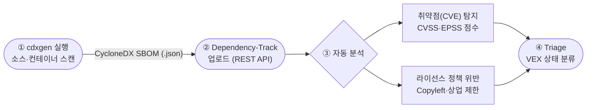

# Part 4 — 라이브 데모

도구로 직접 확인하는 오픈소스 거버넌스 · 20분

<div class="pt-8">
  <span class="text-sm opacity-75">cdxgen → Dependency-Track → 취약점·라이선스 점검</span>
</div>

<!--
지금까지 이론과 체계를 봤으니, 이번 20분은 그게 실제로 어떻게 도는지 두 눈으로 보는 시간입니다. "어렵게 들렸던 SBOM과 취약점 점검이 사실 명령어 몇 줄로 시작된다"는 걸 보여드리겠다고 기대감을 주세요. 데모 들어가기 전에 사전 준비를 미리 확인하세요 — Dependency-Track 서버가 떠 있는지, API Key가 발급돼 있는지, 터미널 폰트가 뒤에서도 보일 만큼 큰지. 라이브가 막히면 미리 찍어둔 녹화 영상이나 캡처 스크린샷으로 대체할 수 있게 준비해 두면 마음이 편합니다.
-->

---

# 자동화 도구로 체계를 작동시키다

<div class="grid grid-cols-2 gap-8 pt-4">

<div>

## 왜 도구인가

수작업으로는 전사 프로젝트의 오픈소스를 추적할 수 없습니다.
오픈소스 관리의 핵심은 두 가지로 압축됩니다.

1. **무엇이 들어있는지 파악** — SBOM(Software Bill of Materials) 생성
2. **위험 요소 지속 모니터링** — 취약점(CVE)·라이선스 정책 위반 탐지

이 두 가지를 무료 오픈소스 도구만으로, **하루 안에** 자동화할 수 있습니다.

</div>

<div>

## cdxgen + Dependency-Track

<Callout variant="info" title="권장 도구 조합">
처음 오픈소스 관리를 시작하는 기업이 기본 자동화 환경을 가장 빠르게 갖출 수 있는 조합입니다. 두 도구 모두 Apache-2.0 라이선스의 무료 오픈소스입니다.
</Callout>

- **cdxgen** — SBOM 생성 (OWASP, CycloneDX 표준)
- **Dependency-Track** — 중앙 서버 분석 (취약점·라이선스 정책)

CycloneDX 형식은 ISO/IEC 5230 및 NTIA SBOM 요건을 충족합니다.

</div>

</div>

<!--
도구로 들어가기 전에 "왜 도구냐"를 한 번 못 박아 주세요. 핵심은 두 가지뿐입니다 — 무엇이 들어있는지 아는 것(SBOM), 그리고 위험을 계속 지켜보는 것(취약점·라이선스). 이걸 전사 규모로 손으로 하는 건 불가능하다는 점을 강조하세요. 오늘 보여드릴 cdxgen과 Dependency-Track은 둘 다 Apache-2.0 무료 오픈소스라 누구나 오늘 당장 깔 수 있다는 점, 그리고 처음 시작하는 기업이 가장 빠르게 기본 자동화 환경을 갖추는 조합이라는 점을 짚어 주세요. cdxgen은 생성기, Dependency-Track은 중앙에서 분석하는 서버 — 역할 분담을 분명히 해두면 다음 다이어그램이 쉽게 따라옵니다.
-->

---

# 데모 시나리오 — 생성·업로드·점검

<div class="text-sm pb-2">SBOM을 만들어 중앙 서버에 올리고, 취약점과 라이선스 위반을 한 화면에서 확인합니다.</div>



<div class="text-xs opacity-70 pt-1">둥근 사각형 = 시작/종료 · 마름모 = 분기</div>

<div class="grid grid-cols-3 gap-4 pt-3 text-sm">
  <div><strong>생성</strong> — cdxgen으로 의존성을 한 번에 스캔</div>
  <div><strong>업로드</strong> — autoCreate로 프로젝트 자동 생성</div>
  <div><strong>점검</strong> — Dashboard에서 심각도별 현황 확인</div>
</div>

<!--
실제 데모로 들어가기 전에 전체 흐름을 이 한 장으로 머릿속에 그려 주세요. 손가락으로 다이어그램을 따라가면서 "① cdxgen으로 SBOM을 만들고 → ② 그걸 Dependency-Track에 REST API로 올리면 → ③ 서버가 알아서 취약점과 라이선스 위반을 분석하고 → ④ 결과를 Triage로 분류한다"고 네 단계로 읽어 주세요. 분기점에서 취약점(CVE)과 라이선스 위반 두 갈래로 나뉜다는 점, 그리고 둘 다 결국 Triage로 모인다는 점이 포인트입니다. 아래 세 칸 — 생성·업로드·점검 — 이 다음 두 실습 슬라이드의 목차라고 예고하면 청중이 따라오기 쉽습니다.
-->

---

# 실습 ① SBOM 생성 + 자동 업로드

<div class="grid grid-cols-2 gap-6">

<div>

<CodeShowcase lang="bash" filename="scan-upload.sh">

```bash {2,5-9}
# 1) SBOM 생성 (CycloneDX 1.6 형식)
cdxgen -r --spec-version 1.6 -o sbom.json .

# 2) Dependency-Track 업로드
curl -s -X POST "${DT_URL}/api/v1/bom" \
  -H "X-Api-Key: ${API_KEY}" \
  -F "autoCreate=true" \
  -F "projectName=my-app" \
  -F "projectVersion=1.0.0" \
  -F "bom=@sbom.json"
```

</CodeShowcase>

<div class="text-xs opacity-70 pt-2">실행: <code>export DT_API_KEY=...</code> 후 <code>./scan-upload.sh my-app 1.0.0</code></div>

</div>

<div>

## 핵심 포인트

- **`--spec-version 1.6`** — cdxgen 최신 버전은 CycloneDX 1.7을 기본 생성하지만, Dependency-Track v4.14는 1.6까지 지원하므로 명시 필요
- **`autoCreate=true`** — 프로젝트가 없으면 자동 생성
- **API Key** — `BOM_UPLOAD` + `PROJECT_CREATION_UPLOAD` 권한 팀에서 발급

<Callout variant="success" title="더 빠른 시작">
Node.js 설치 없이 Docker만으로 SBOM을 만들려면 SK텔레콤 SBOM Scanner를 사용할 수 있습니다. 출력이 CycloneDX JSON이라 그대로 업로드됩니다.
</Callout>

</div>

</div>

<!--
여기서 첫 번째 라이브 실연입니다. 진행 순서는 — ① 터미널에서 미리 export 해둔 DT_API_KEY를 확인하고 ② cdxgen 한 줄로 sbom.json을 생성하는 걸 보여준 뒤 ③ curl로 업로드해서 응답이 돌아오는 걸 확인하는 흐름입니다. 사전 준비물은 cdxgen 설치, 떠 있는 Dependency-Track 서버, BOM_UPLOAD와 PROJECT_CREATION_UPLOAD 권한이 붙은 API Key 세 가지입니다. 오른쪽 핵심 포인트 중 --spec-version 1.6을 꼭 강조하세요 — cdxgen 최신 버전은 1.7을 기본 생성하는데 Dependency-Track v4.14는 1.6까지만 받으므로 명시하지 않으면 업로드가 실패합니다. autoCreate=true 덕분에 프로젝트를 미리 안 만들어도 된다는 점도 짚어 주세요. cdxgen이 안 깔린 환경이거나 시간이 빠듯하면 Docker만으로 도는 SK텔레콤 SBOM Scanner로 대체하면 되고, 그래도 막히면 녹화 영상으로 넘어가세요.
-->

---

# 실습 ② 결과 확인 + 취약점 Triage

<div class="grid grid-cols-2 gap-6">

<div>

## Dashboard에서 확인

업로드 직후 프로젝트가 자동 생성되고, 중앙 서버가 분석을 시작합니다.

| 항목 | 내용 |
|------|------|
| **Portfolio Vulnerabilities** | 전사 취약점 심각도별 현황 |
| **Projects at Risk** | 위험도 높은 프로젝트 |
| **Policy Violations** | 라이선스 정책 위반 현황 |

<div class="text-xs opacity-70 pt-2">취약점 DB(NVD·GitHub Advisories) 초기 동기화에는 최소 24시간이 소요됩니다.</div>

</div>

<div>

## Triage — 다 긴급은 아니다

모든 Critical을 즉시 처리할 필요는 없습니다. 실제 영향을 기준으로 분류합니다.

<VexStatus legend />

- 사용 중 버전이 아니면 → **Not Affected**
- 취약 기능을 호출하지 않으면 → **Not Affected** (사유 기록)
- 패치 존재 → **Exploitable**, 업그레이드 요청

</div>

</div>

<Callout variant="info" title="라이선스 정책 위반 대응">
WARN(경고)은 개발팀과 협의 후 문제없으면 Approved 처리, FAIL(차단)은 허용 라이선스 버전으로 교체를 요청합니다. AI SBOM도 동일한 흐름으로 점검합니다.
</Callout>

<!--
두 번째 실연 — 업로드한 결과를 웹 대시보드에서 같이 봅니다. 진행 순서는 ① 자동 생성된 프로젝트를 열어 Portfolio Vulnerabilities·Projects at Risk·Policy Violations 세 위젯을 짚어주고 ② 취약점 하나를 골라 Triage 흐름을 보여주는 것입니다. 여기서 가장 중요한 메시지는 "Critical이 떴다고 다 긴급은 아니다"입니다 — 안 쓰는 버전이거나 취약 기능을 호출하지 않으면 Not Affected로 사유를 기록하고, 패치가 있으면 Exploitable로 분류해 업그레이드를 요청한다고 VEX 4상태로 설명하세요. 단, 데모 당일 주의점이 하나 있습니다 — NVD·GitHub Advisories 취약점 DB 초기 동기화에 최소 24시간이 걸리므로, 새로 띄운 서버라면 취약점이 안 보일 수 있습니다. 그래서 데모용 서버는 전날 미리 띄워 동기화를 끝내두거나, 안 되면 동기화 완료된 화면 캡처로 대체하세요. 라이선스 위반도 WARN은 협의 후 Approved, FAIL은 교체 요청이라는 동일한 흐름이고 AI SBOM도 똑같이 점검한다고 마무리하면 됩니다.
-->

---
layout: section
class: text-center
---

# Part 5 — 마무리

핵심 회고와 첫 액션 · 15분 (Q&A 포함)

<!--
데모로 손에 잡히는 그림까지 봤으니, 이제 4시간 전체를 핵심만 추려 회고하는 시간입니다. "오늘 많은 걸 다뤘는데, 돌아가서 딱 세 가지만 기억하면 된다"고 부담을 덜어 주세요. 이 파트는 정리·첫 액션·Q&A로 구성되며 15분 정도라고 안내하고, Q&A 시간을 넉넉히 남기기 위해 회고는 빠르게 짚고 넘어가겠다고 페이스를 잡으세요.
-->

---

# 6대 핵심 요소, 다시 한눈에

<div class="grid grid-cols-2 gap-8 items-center">

<div>

<HexCoreElements />

</div>

<div>

오늘 다룬 거버넌스 체계는 **하나의 유기적 구조**입니다.

1. **조직** — 역할·책임·역량 정의
2. **정책** — 성문화된 판단 기준
3. **프로세스** — 정책이 작동하는 절차
4. **도구** — 규모를 자동화로 해결
5. **교육** — 사람이 알아야 작동
6. **준수** — 공식 확인·지속 유지

<Callout variant="success" title="핵심">
어느 하나만으로는 작동하지 않습니다. 여섯 요소가 맞물려야 ISO/IEC 5230·18974를 충족하는 살아있는 체계가 됩니다.
</Callout>

</div>

</div>

<!--
오늘 강의를 관통한 6대 핵심 요소 — 조직·정책·프로세스·도구·교육·준수 — 를 다시 한 장으로 모읍니다. 왼쪽 육각형 다이어그램을 가리키며 "이게 오늘의 전체 지도였다"고 회수해 주세요. 가장 강조할 메시지는 어느 하나만으로는 작동하지 않는다는 점입니다 — 정책만 있고 프로세스가 없거나, 도구만 깔고 교육이 없으면 체계가 죽는다는 걸 한두 문장으로 예를 들어 주면 좋습니다. 여섯이 맞물려야 ISO/IEC 5230과 18974를 충족하는 살아있는 체계가 된다는 말로 마무리하세요.
-->

---

# Review — 기억할 핵심 3가지

<div class="grid grid-cols-3 gap-6 pt-4">

<div>

## 1. 세 표준의 역할

<StandardCompare highlight="5230" :rows="[
  { aspect: '대상', v5230: '라이선스', v18974: '보안 취약점', v42001: 'AI 관리' },
  { aspect: '입증자료', v5230: '25개', v18974: '25개', v42001: '체크포인트' },
]" />

<div class="text-sm pt-2">입증자료는 표준별 <strong>각 25개, 합계 50개</strong>(공통 16개 중복)로 셉니다.</div>

</div>

<div>

## 2. AI는 확장이다

기존 거버넌스 위에 AI를 **얹습니다**. 프레임워크·모델·데이터셋 3대 영역, AI SBOM, AI 코딩 도구, 모델 공급망이 추가 점검 대상입니다.

<Callout variant="info" title="용어">
OSAID 1.0(OSI 2024-10)으로 "오픈소스 AI"의 정의가 생겼습니다. Open Weight 모델과 구분하세요.
</Callout>

</div>

<div>

## 3. 준수는 회고형이다

자가 인증은 미래 보장이 아니라 **"지난 18개월간 충족해 왔음"**을 확인하는 것입니다.

<Callout variant="warn" title="시제 주의">
인증 후에도 18개월 주기로 충족 상태를 유지·재확인해야 합니다.
</Callout>

</div>

</div>

<!--
"돌아가서 딱 세 가지만 기억하세요"라고 했던 그 세 가지입니다. 첫째, 세 표준은 역할이 다르다 — 5230은 라이선스, 18974는 보안 취약점, 42001은 AI 관리이고 입증자료는 5230·18974 각 25개로 공통 16개가 겹쳐 합계 50개라는 점을 짚으세요. 둘째, AI는 완전히 새로운 게 아니라 기존 거버넌스 위에 얹는 확장이며, OSAID 1.0으로 "오픈소스 AI"의 정의가 생겼으니 Open Weight 모델과 구분하라는 점. 셋째, 준수는 미래 보장이 아니라 회고형이다 — 자가 인증은 "지난 18개월간 충족해 왔음"을 확인하는 것이고 인증 후에도 18개월 주기로 재확인해야 한다는 시제를 강조하세요. 세 카드를 빠르게 짚고 다음 액션 슬라이드로 넘어가면 됩니다.
-->

---

# 첫 액션 · 다음 단계 · Q&A

<div class="grid grid-cols-2 gap-8">

<div>

## 내일부터 할 수 있는 첫 액션

1. **조직** — 오픈소스 담당자 1명 지정 (겸직 가능)
2. **정책** — 정책 템플릿 기반 초안 작성 (CC BY 4.0)
3. **도구** — cdxgen + Dependency-Track으로 한 프로젝트 SBOM 생성
4. **점검** — 입증자료 50개 커버리지 표를 체크리스트로 활용

<Callout variant="success" title="혼자서도 시작 가능">
모든 도구와 템플릿은 무료 오픈소스입니다. 작은 프로젝트 하나로 먼저 체계를 검증한 뒤 전사로 확장하세요.
</Callout>

</div>

<div>

## 함께하기 — OpenChain KWG

OpenChain Korea Work Group은 한국 기업의 오픈소스 컴플라이언스 담당자 커뮤니티입니다.

- **정기 미팅** — 사례·도구·표준 동향 공유
- **가이드·템플릿** — 이 강의의 모든 근거 자료 공개
- **서브그룹** — SBOM·AI·Telco 분과 활동

<div class="pt-6 text-center">
  <div class="text-2xl font-bold" style="color: var(--oc-primary)">감사합니다</div>
  <div class="text-sm opacity-75 pt-2">질문을 환영합니다 · Q&A</div>
</div>

</div>

</div>

<!--
마지막 슬라이드입니다. 거창하게 끝내기보다 "내일 당장 할 수 있는 것"으로 착지시키세요 — 담당자 1명 지정, 정책 템플릿으로 초안 작성, cdxgen+Dependency-Track으로 한 프로젝트 SBOM 생성, 입증자료 50개 표를 체크리스트로 활용. "전사로 한 번에 가지 말고 작은 프로젝트 하나로 먼저 체계를 검증하라"는 현실적인 조언을 꼭 덧붙이세요. 그다음 OpenChain KWG를 소개하면서 "혼자 끙끙대지 말고 커뮤니티에 와서 사례를 나누자" — 정기 미팅·공개 가이드·서브그룹(SBOM·AI·Telco) — 로 자연스럽게 연결하고, 오늘 강의의 모든 근거 자료가 KWG에 공개돼 있다는 점을 알려 주세요. 마지막으로 감사 인사와 함께 Q&A로 열어 청중 질문을 받으면 됩니다. 질문이 없으면 "가장 막막한 단계가 어디였나요?"처럼 먼저 던져 대화를 유도하세요.
-->


