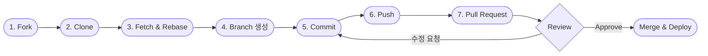

# Git Workflow

OpenChain-KWG 웹사이트 개발을 위한 Git Workflow를 설명합니다.



## Step 1. Fork

1. https://github.com/OpenChain-Project/OpenChain-KWG 에 방문하여,
2. 화면 우상단의 **Fork** 버튼을 눌러 fork합니다.

## Step 2. Clone

Fork한 repository를 Local working directory로 Clone하고, Remote에 Upstream repository를 추가합니다.

```bash
$ git clone https://github.com/[user]/OpenChain-KWG.git
Cloning into 'OpenChain-KWG'...
...

$ cd OpenChain-KWG
$ git remote add upstream https://github.com/OpenChain-Project/OpenChain-KWG.git
$ git remote -v
origin      https://github.com/[user]/OpenChain-KWG.git (fetch)
origin      https://github.com/[user]/OpenChain-KWG.git (push)
upstream    https://github.com/OpenChain-Project/OpenChain-KWG.git (fetch)
upstream    https://github.com/OpenChain-Project/OpenChain-KWG.git (push)
```

## Step 3. Fetch and Rebase

(Clone 후 시간이 지난 시점이라면) fetch했을때 upstream에 변경 사항이 있을 경우 rebase하여 master branch를 최신 상태로 유지합니다.

```bash
$ git fetch upstream
$ git checkout master
$ git rebase upstream/master
```

## Step 4. 개발용 Branch 생성

개발용 Branch를 생성합니다.

```bash
$ git checkout -b develop
```

## Step 5. Commit

수정 사항을 반영 후 Commit 합니다. commit message는 가능한 자세히 작성하세요.

```bash
$ git add .
$ git commit
```

## Step 6. Push

생성한 commit을 origin의 develop branch에 push합니다.

```bash
$ git push -f origin develop
```

## Step 7. Create a Pull Request

GitHub 사이트로 가서 Pull Request를 생성합니다. 이때 Upstream repository의 develop branch로 Create Pull Request하여 수정사항을 제출합니다.

---

## 소스 코드 다운로드

OpenChain KWG 웹사이트의 소스 코드는 위의 [Git Workflow](#git-workflow)의 [Step 1](#step-1-fork)부터 [Step 4](#step-4-개발용-branch-생성)까지 수행하여 다운로드 하세요.

## 수정 사항 제출 (Pull Request)

OpenChain KWG 웹사이트의 소스 코드 추가/수정한 이후에는 위의 [Git Workflow](#git-workflow)의 [Step 5](#step-5-commit)부터 [Step 7](#step-7-create-a-pull-request)까지 수행하여 제출(Pull Request)하세요.
